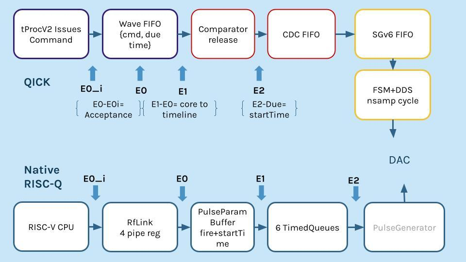
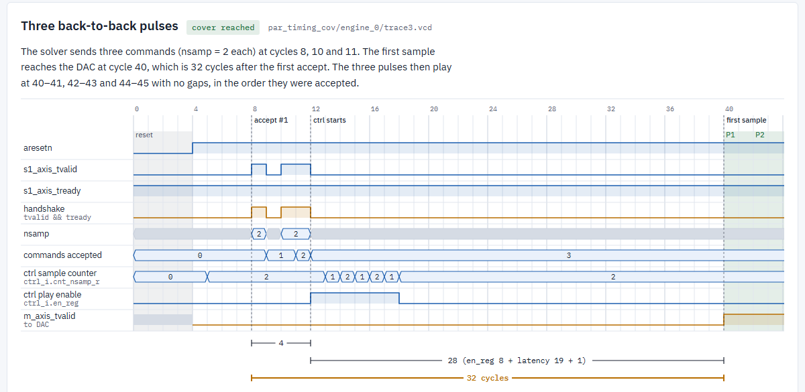

## The project

[QICK](https://github.com/openquantumhardware/qick) is an open-source platform for controlling quantum experiments on Xilinx RFSoC boards. It replaces racks of lab instruments that can cost $250k–$500k with a single board. Its current timed processor, tProcV2, makes firmware development difficult: it uses a proprietary instruction set, so users have to learn QICK's custom processor architecture before they can write a program.

Our Harvey Mudd clinic team, sponsored by HRL Laboratories, is replacing tProcV2 with a RISC-V-compatible controller generated by the [RISC-Q](https://arxiv.org/abs/2505.14902) framework. An open, widely supported instruction set lowers the barrier for researchers and engineers who already know RISC-V tools. The new controller has to keep QICK's existing signal generators, readouts and Python API, while supporting compiled RISC-V programs, sub-nanosecond pulse timing, and the loops, branches and arithmetic that quantum control sequences need.

## My role: verification

The seven-person team is split into three subgroups: controller and core, software interface, and verification and validation. I'm on verification. Our job is to prove that the RISC-Q controller behaves exactly like tProcV2 wherever the rest of QICK depends on it, and to find out where it doesn't.

I wrote the verification plan. It's modeled on UVM's monitor, transaction and scoreboard structure, without using a full UVM library, and has three layers:

- **Legality:** encode the hardware's assumptions, like valid field ranges, so illegal commands are caught at the boundary.
- **Equivalence:** differential testing, with tProcV2 as the golden reference. The same program runs on a QICK emulator testbench in Verilator and in RISC-Q's simulator, and we compare *what* each one outputs and *when*.
- **Stress and formal:** SymbiYosys runs on the real RTL to explore corner cases that directed tests miss. On the validation side, the design is flashed onto a ZCU216 board for capacity, late-command, ordering, skew, restart and long-run tests.

## Timing checkpoints

The hardest part to match is timing. A pulse command passes through several queues and a clock-domain crossing before it reaches the DAC. I defined matching checkpoints in both designs so we can measure acceptance, core-to-timeline delay and start time at each stage, and compare them directly.

## What formal verification found

Running SymbiYosys on QICK's real signal generator RTL, with the real Xilinx FIFO source, pinned down the command path's exact timing:

| Measurement | Result |
|---|---|
| Command accepted → first DAC sample | 32 clock cycles |
| tProc timestamp → generator accepts command | 12 cycles (44 to first sample) |
| Generator command queue | 19 commands deep |
| Lead time a program needs | 9 cycles is always on time; 5 arrives late |

It also turned up corner cases the RISC-Q adapter has to handle:

- Commands sent in the first 4 cycles after reset get a handshake but are silently dropped.
- A pulse length of 0 or 1 wraps a 16-bit counter and plays for about 65,536 cycles.
- When one generator's queue is full, the shared clock-domain-crossing block can hand the same command to the other generators repeatedly.
- The dispatcher can change a command's data under backpressure, which violates AXI-Stream.
- Pulse lengths of 65,536 or more wrap silently.

On RISC-Q's side, the same approach showed that its wave bridge can lose a pulse without any error when the queue is full. tProcV2 stalls its CPU when a queue fills up, but RISC-Q's writes are posted, so there's no path back to stall the CPU. Fixing that takes an architectural change to RISC-Q's link, and that requirement now feeds into the adapter design.

