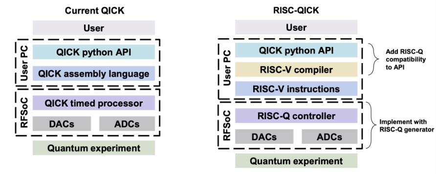
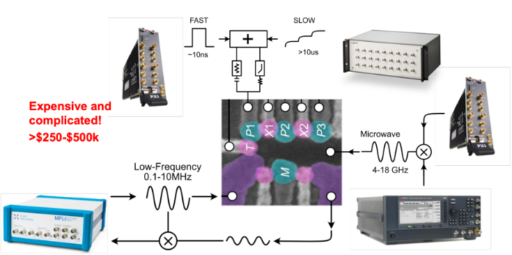
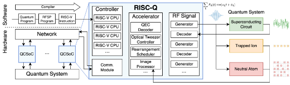
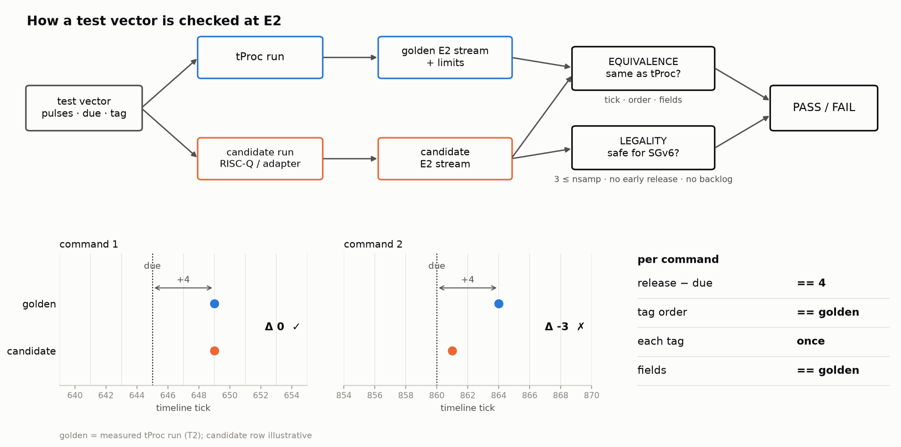
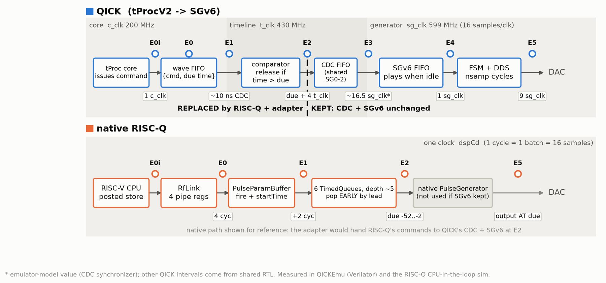
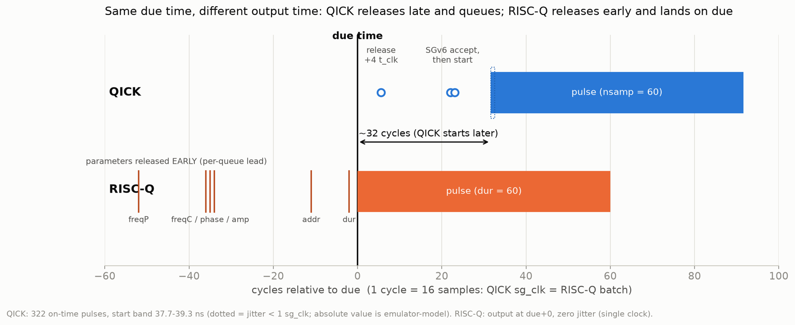
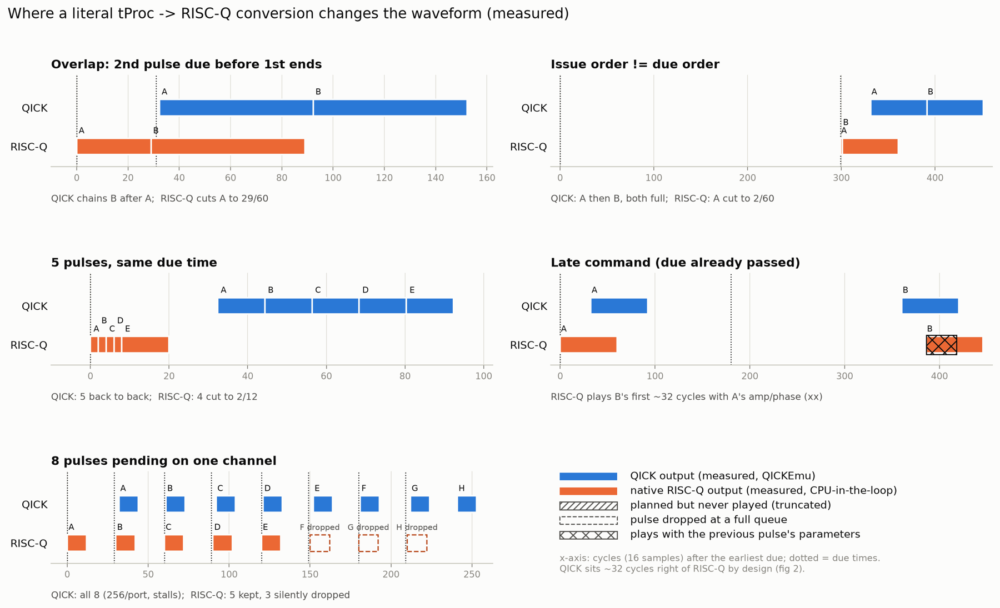
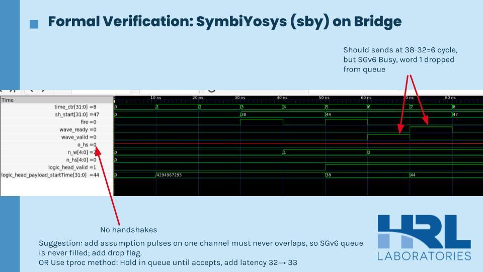
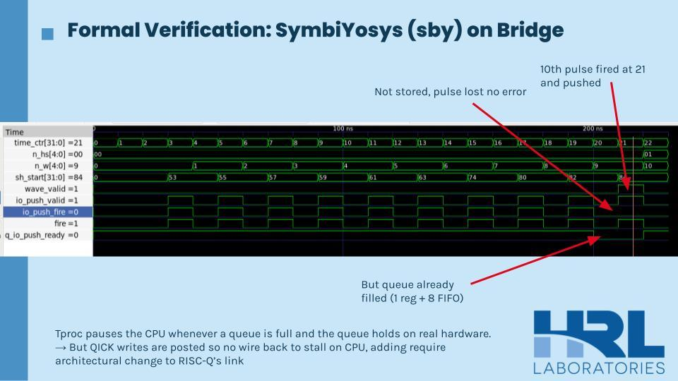

## The project

[QICK](https://github.com/openquantumhardware/qick) is an open-source platform for controlling quantum experiments on Xilinx RFSoC boards. It replaces racks of lab instruments that can cost $250k–$500k with a single board. Its current timed processor, tProcV2, makes firmware development difficult: it uses a proprietary instruction set, so users have to learn QICK's custom processor architecture before they can write a program.

Our Harvey Mudd clinic team, sponsored by HRL Laboratories, is replacing tProcV2 with a RISC-V-compatible controller generated by the [RISC-Q](https://arxiv.org/abs/2505.14902) framework. An open, widely supported instruction set lowers the barrier for researchers and engineers who already know RISC-V tools. The new controller has to keep QICK's existing signal generators, readouts and Python API, while supporting compiled RISC-V programs, sub-nanosecond pulse timing, and the loops, branches and arithmetic that quantum control sequences need.

## My role: verification

The seven-person team is split into three subgroups: controller and core, software interface, and verification and validation. I'm on verification. Our job is to prove that the RISC-Q controller behaves exactly like tProcV2 wherever the rest of QICK depends on it, and to find out early where it doesn't.

## The verification plan

I designed the plan. It borrows UVM's monitor, transaction and scoreboard structure without a full UVM library, and has three layers:

- **Legality:** encode the hardware's assumptions, like valid field ranges and a minimum pulse length, so unsafe commands are caught at the boundary.
- **Equivalence:** differential testing with tProcV2 as the golden reference. The same test vector runs on QICK and on the RISC-Q candidate, and a scoreboard compares *what* each one emits and *when*: release time relative to the due time, tag order, each command exactly once, and every field.
- **Stress and formal:** SymbiYosys on the real RTL explores the corner cases that directed tests miss. For validation, the design is flashed onto a ZCU216 board for capacity, late-command, ordering, skew, restart and long-run tests.

To make that comparison possible, I set up a Verilator simulation environment compatible with QICKEmu, QICK's emulator, and wrote the first controller-level comparison of control-signal outputs between QICK and RISC-Q.

## Timing characterization

Timing is the hardest thing to match. A QICK pulse command crosses three clock domains (200, 430 and 599 MHz) and several queues before it reaches the DAC. RISC-Q runs on a single clock and schedules differently. I added always-on monitors to the testbench that log every command at each pipeline event (E0i through E5) in QICK, plus an event logger in RISC-Q's CPU-in-the-loop simulator, so the same events can be compared across both designs.

Across 322 on-time pulses, QICK started each pulse in a narrow band with less than one generator clock of jitter. The measurements also showed a basic difference between the designs. QICK releases a command after its due time and starts the pulse about 32 cycles later. RISC-Q releases pulse parameters early and lands exactly on the due time.

That difference matters because a literal tProc-to-RISC-Q conversion changes the waveform. Overlapping pulses get cut short, commands issued out of due order get truncated, and with eight pulses pending on one channel RISC-Q keeps five and silently drops three. These cases define what the adapter has to handle.

## Formal verification of the WaveWordBridge

The WaveWordBridge is the adapter piece that turns RISC-Q's commands into QICK's 168-bit wave words. I wrote 35 SymbiYosys tasks for it, run on the bridge RTL generated with the integration parameters and with QICK's `sg_translator` behind it.

**Proven (pass):** every word is released exactly at its start time minus 32 cycles and never early. Every word arrives exactly once, in order, with all 168 bits intact. Reset clears pending words, and the signal generator decodes exactly the values the CPU sent.

**Measured limits:** a pulse must be fired at least 35 cycles ahead (it's one cycle late for each cycle short), and start times must be in order and at least 2 cycles apart.

**Found (fail):** three ways the bridge can lose or corrupt a pulse with no error:

- A word is lost when the signal generator isn't ready, because the bridge never checks its ready signal.
- The queue holds 9 pending pulses, and the 10th is silently dropped. tProcV2 avoids this by stalling its CPU when a queue fills, but RISC-Q's writes are posted, so there's no path back to stall the CPU.
- Pulse lengths under 3 and out-of-range fields pass straight through or are silently truncated to 16 bits.

For the dropped words I proposed two fixes to the controller team: either assume pulses on a channel never overlap and add a drop flag, or hold words in the queue until they're accepted, the way tProc does, at the cost of one extra cycle of latency (32 → 33).

## Acknowledgements

Thanks to our HRL Laboratories liaisons Abbie Wessels, Paul Jerger and Jessica Liu, our faculty advisor Benson Tsai, and team lead Julia Gong. Diagrams marked HRL Laboratories are from the liaisons' clinic launch slides.
