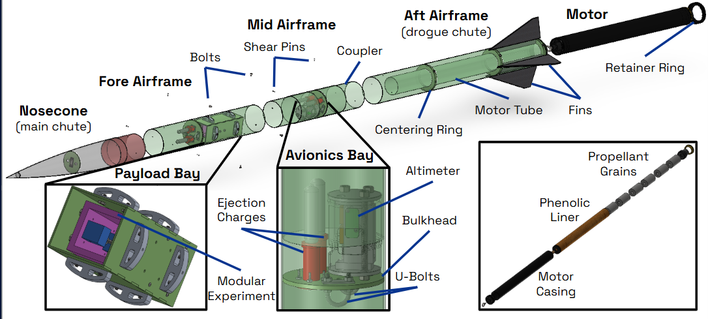
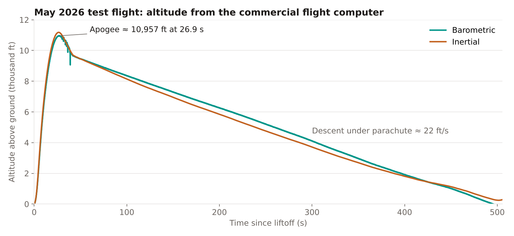
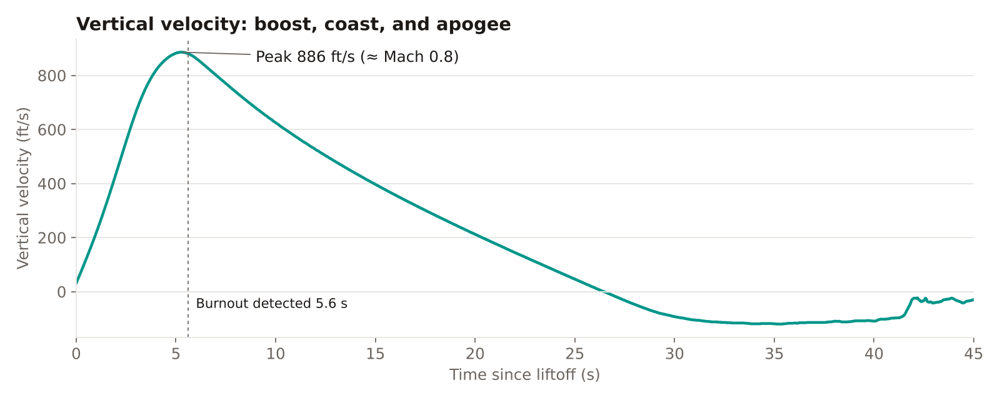
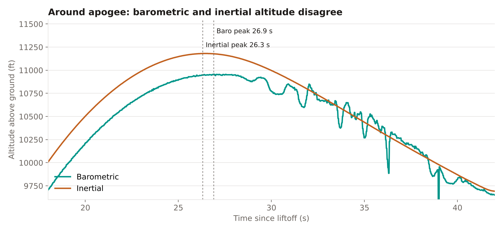
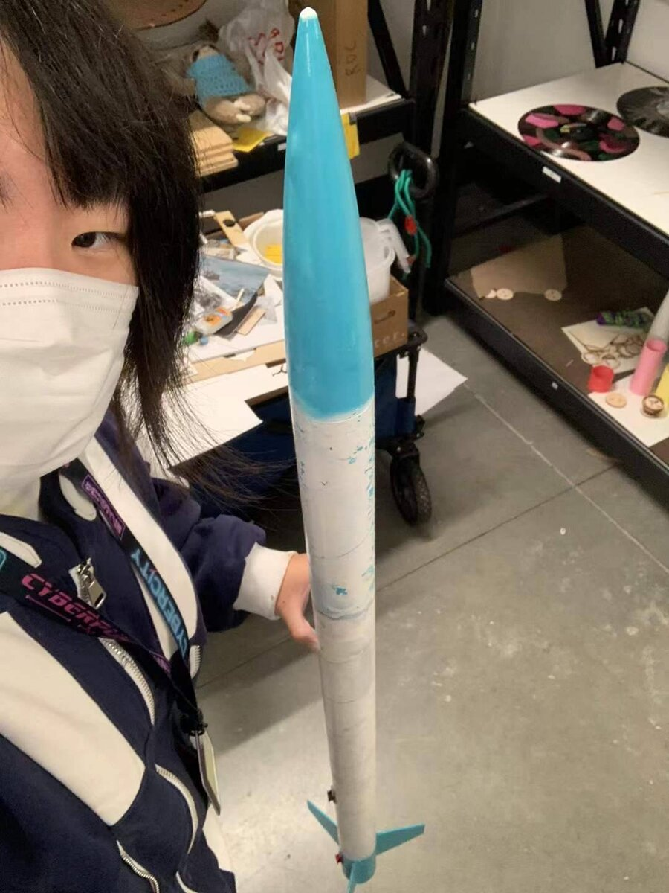
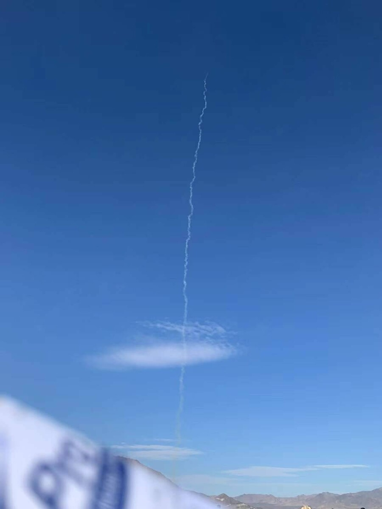

## The team

MARC is Harvey Mudd's student rocketry club. Its competition team designs, builds and launches a high-power rocket each year at the Friends of Amateur Rocketry (FAR) Unlimited intercollegiate competition in the Mojave Desert. Most members join with no rocketry experience, and the club is built around giving them real engineering tasks across structures, recovery, propulsion and avionics.

## Competition results

The team placed 5th in 2024, 3rd in 2025 with Gladius III, which flew within 0.05% of its simulated apogee, and 1st in 2026 with Apollyon I, the program's first championship.

## How the rocket is put together

Our competition rockets are dual-deploy. A small drogue parachute comes out at apogee so the rocket falls fast without drifting miles away, and the large main parachute opens closer to the ground for a gentle landing. That drives the layout: the nosecone holds the main chute, the aft airframe holds the drogue, and the avionics bay sits between them so its ejection charges can push each section apart. Shear pins hold the sections together through boost and only break when a charge fires. The payload bay carries a swappable experiment module, and the motor slides into a motor tube held by centering rings and locked in with a retainer ring.

## What a flight looks like in the data

This is the log from a May 2026 test flight, recorded by the commercial flight computer in the avionics bay. The motor burns for about five and a half seconds and takes the rocket to 886 ft/s, around Mach 0.8. It then coasts for another 21 seconds to an apogee of about 10,960 ft above the ground, and spends the next eight minutes coming down under parachute at roughly 22 ft/s.

The zoom around apogee shows why avionics is mostly about trusting the right sensor at the right time. The inertial estimate, integrated from the accelerometer, is smooth but peaks about 220 ft higher than the barometer, because small errors add up over 26 seconds of integration. The barometer is closer to the truth on altitude but gets noisy right after apogee, when the rocket turns over and the pressure at its ports jumps around. Deciding that apogee has really happened from two signals that disagree is the problem behind my apogee-detection timing work.

## Onboard video

<strong>Motion warning:</strong> this footage spins a lot and may make you dizzy.

<figure>
  <video controls preload="none" playsinline poster="/media/marc-onboard.jpg">
    <source src="/media/marc-onboard.mp4" type="video/mp4" />
  </video>
  <figcaption>Highlights from the rocket's onboard camera</figcaption>
</figure>

## Avionics

Avionics covers everything electronic on the rocket: the flight computers that detect apogee and fire the recovery charges, the sensors, and the arming and safety procedures on launch day. During ascent a rocket can pull enough g's to saturate a typical accelerometer, and that's exactly when you need a good estimate of where it is. I combined redundant sensors so the state estimate stays reliable through high-g saturation, which cut our apogee-detection timing error by about 30%, and ran a magnetometer interference study.

## Now: Atlas, a custom flight computer for active guidance

Until now our rockets have relied on passive stability. This year the team is taking on active guidance, using sensor feedback to move control surfaces in flight. We're comparing three approaches, canards near the nose, air brakes that deploy from the body, and flaps on the rear fins, on smaller Level 2 test rockets before choosing one for the competition vehicle. The team has also written up a two-stage concept, weighing drag separation against charge-separated cold staging and an electronically lit sustainer motor. All of that needs a flight computer we design ourselves.

Atlas is that board, still very much a work in progress. It's built around an STM32H743 running FreeRTOS:

- **Sensing with overlap on purpose:** an ADXL375 high-g accelerometer for the boost phase, an LSM6DSV16B IMU, an MMC5983MA magnetometer, an MS5611 barometer, a BNO085 orientation sensor, and a u-blox NEO-M9N GNSS receiver whose timing pulse lines up every log.
- **Links:** an RFD900x long-range telemetry radio, Bluetooth through a NINA-B112, USB to a desktop ground-station dashboard, and microSD logging.
- **Outputs:** eight PWM servo channels at 333 Hz for control surfaces and five pyro channels for recovery charges.

Safety is designed in from the start. Every output boots disabled, firing needs a software arm plus a measured armed feed, and each pyro channel fires a fixed 500 ms pulse with a limited number of attempts per power cycle. The first board revision is in bench bring-up now: drivers and host tests are in place, and a fixed bench demo already runs four-servo gravity stabilization. Every subsystem still has to pass physical qualification before it flies.

## Teaching

I wrote a Level 1 rocket design guide for beginners and have led rocket-building sessions for more than 60 students. Level 1 is the first high-power certification level, and I built and launched my own L1 rocket before teaching others to.

 

Follow the team on [Instagram](https://www.instagram.com/hmcmarc/) for launch-day photos and build updates.
