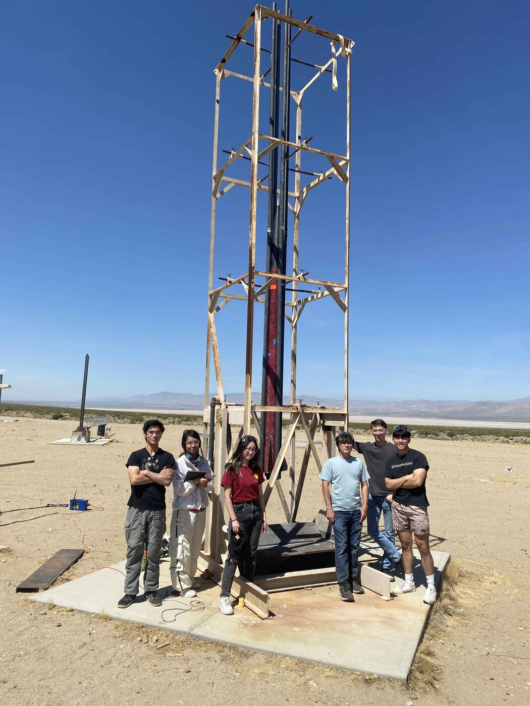
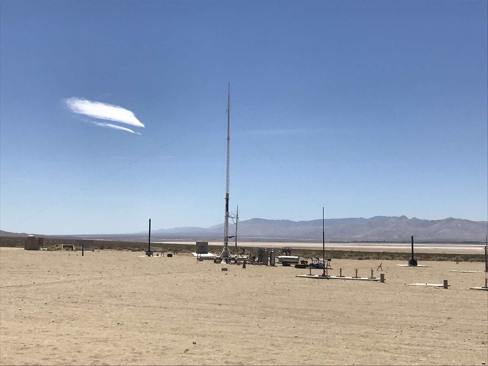
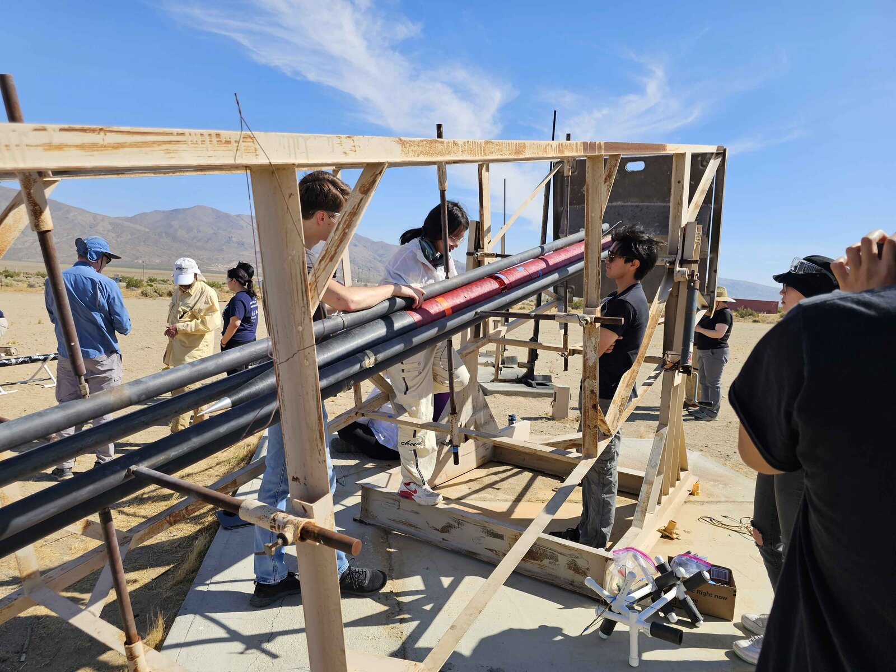

## The team

MARC is Harvey Mudd's student rocketry club. Its competition team designs, builds and launches a high-power rocket each year at the Friends of Amateur Rocketry (FAR) Unlimited intercollegiate competition in the Mojave Desert. Most members join with no rocketry experience, and the club is built around giving them real engineering tasks across structures, recovery, propulsion and avionics.

## Competition results

The team placed 5th in 2024, 3rd in 2025 with Gladius III, which flew within 0.05% of its simulated apogee, and 1st in 2026 with Apollyon I, the program's first championship.

## Avionics

Avionics covers everything electronic on the rocket: the flight computers that detect apogee and fire the recovery charges, the sensors, and the arming and safety procedures on launch day. During ascent a rocket can pull enough g's to saturate a typical accelerometer, and that's exactly when you need a good estimate of where it is. I combined redundant sensors so the state estimate stays reliable through high-g saturation, which cut our apogee-detection timing error by about 30%, and ran a magnetometer interference study.

## Now: Atlas, a custom flight computer for active guidance

Until now our rockets have relied on passive stability. This year the team is taking on active guidance, using sensor feedback to move control surfaces in flight. We're testing canards, air brakes and rear-fin flaps on smaller test rockets before choosing one for the competition vehicle, and that needs a flight computer we design ourselves.

Atlas is that board, still very much a work in progress. It's built around an STM32H743 running FreeRTOS, with:

- **Redundant sensing:** a high-g accelerometer alongside an IMU, a magnetometer, a barometer, an orientation sensor and GPS with a timing pulse.
- **Links:** a long-range telemetry radio, Bluetooth, USB to a desktop ground-station dashboard, and microSD logging.
- **Outputs:** eight servo channels for control surfaces and five pyro channels for recovery charges.

Safety is designed in from the start. Every output boots disabled, firing needs a software arm plus a measured armed feed, and each pyro channel gets a fixed number of attempts per power cycle. The first board revision is in bench bring-up now: drivers and host tests are in place, and a bench demo already holds a platform level with four servos. Every subsystem still has to pass physical qualification before it flies.

## Teaching

I wrote a Level 1 rocket design guide for beginners and have led rocket-building sessions for more than 60 students. Follow the team on [Instagram](https://www.instagram.com/hmcmarc/) for launch-day photos and build updates.
