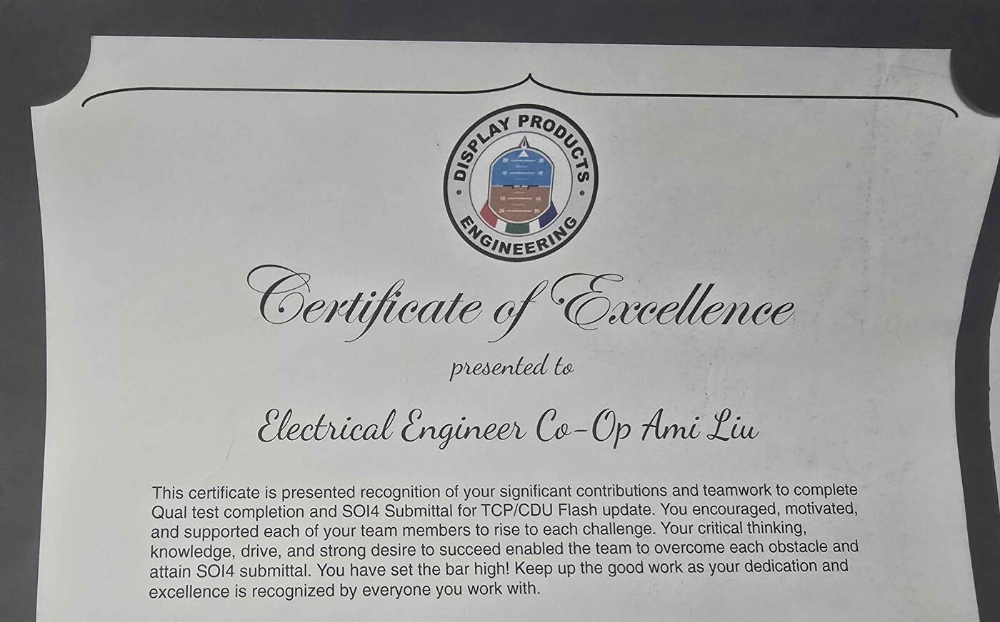
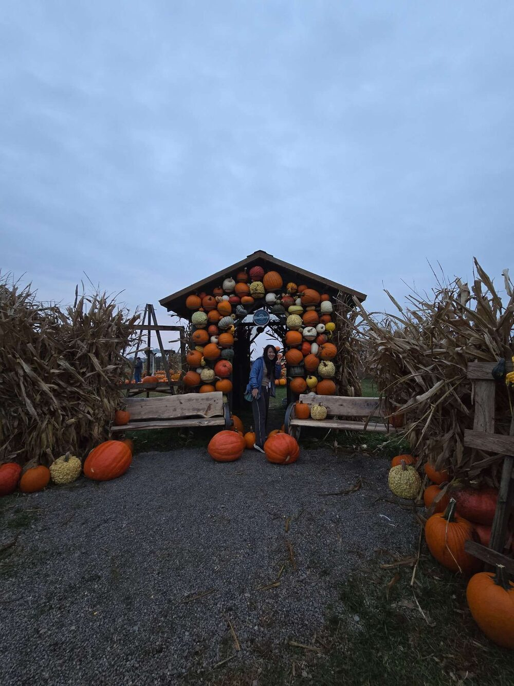

## The role

I joined the avionics display group as a co-op and worked across the hardware lifecycle of cockpit display control panels: design changes, first-article bring-up, verification against requirements, and environmental qualification. Over the co-op, six panels moved through final production release to the customer.

## Replacing a flash memory, and proving it survives radiation

The panels store their display firmware and configuration in a parallel NOR flash that had gone obsolete, so it needed a replacement. At cruise altitude, high-energy neutrons can flip a bit in memory (a single-event upset) or push a chip into a high-current latch-up that forces a restart. A flipped bit in RAM is usually caught by error correction, but a flipped bit in flash stays there through power cycles. On a cockpit display that could mean corrupted characters or a mislabeled altitude reading that only shows up weeks later.

Beam testing exposes exactly that kind of failure, so the customer required it. I modified a circuit card layout and rerouted more than ten signal lines so two display units could be instrumented for the test. The goal was to confirm that the new part doesn't produce persistent upsets, and that the firmware recovers correctly when one happens.

## Chasing an EMI failure

During DO-160G qualification, a unit kept failing radiated emissions at 150 MHz, which lined up with the second harmonic of a 74 MHz clock. I stepped up the series resistor at the clock driver to slow its edges, checked the before and after waveforms on an oscilloscope, and the unit passed. Then came the harder question of which earlier test results still held after the change. Slower edges are worst in the cold, so we reran the low-temperature operating test and kept the rest. That recovered about three weeks of schedule.

## Rebuilding a JTAG adapter

The AFD-3010E Ethernet video card needed a new adapter for programming and boundary-scan testing. Before choosing any termination, I traced the real direction of every signal to find where each line actually starts and ends. That decided where series damping and far-end termination belonged, and ruled out terminating both ends at once, which can overdrive the chip. I designed the level-shifted board in Altium. It worked on the first spin, and I led its bring-up, documentation and qualification.

## Untangling an old emissions test

One audio-frequency emissions test had a mystery box in its setup. It appeared in old test reports, its contents had changed over the years with no clear record, and the procedure drawing didn't quite agree with the requirements. Going back to the DO-160 standard, I found two separate test methods, one for a single wire and one for a bundle, that the procedure had blended together. We had a bundle, so we used that method, redlined the procedure with the technicians and engineers, and swapped the box for a clear one so future reports show exactly which parts were used.

## Smaller pieces

- **Requirements:** 450+ hardware requirements and 300+ verification test cases in DOORS, traced through five formal PREP reviews, plus Service Bulletin drafts for the technical writers.
- **Gasket model:** an analytical model of gasket deformation used to set geometric constraints.
- **Quick-turn PCB guide:** a guide for prototype boards, written with input from layout, component and manufacturing engineers so that what works as a prototype carries over to production without a redesign.

## Recognition

In March 2026 the Display Products Engineering group gave me its Certificate of Excellence for helping the team finish qualification testing and submit the flash-update program for certification review.

