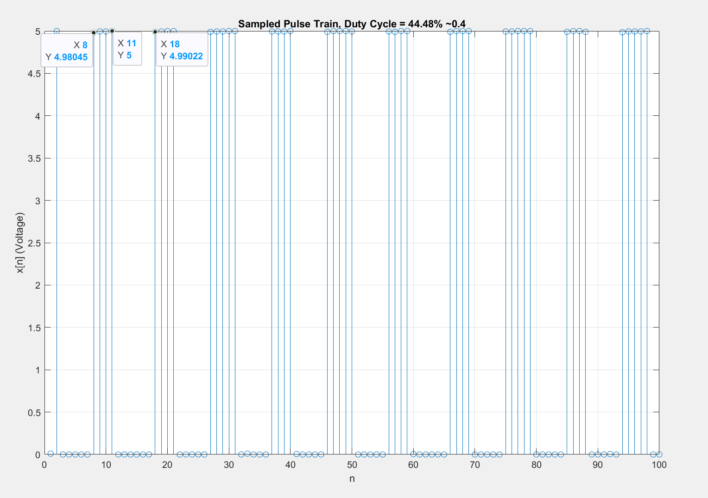
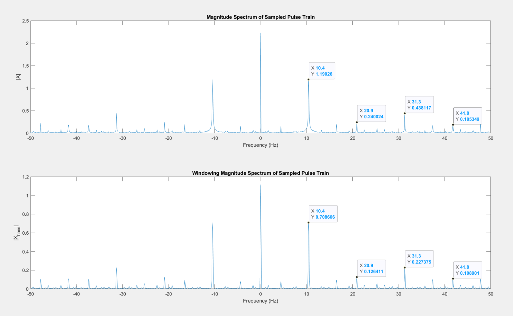
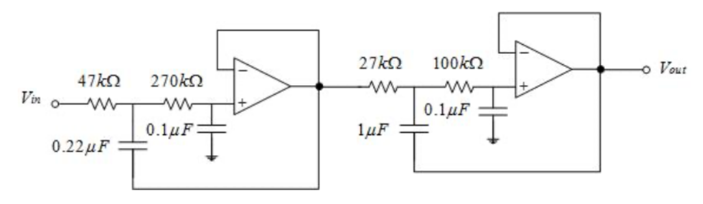
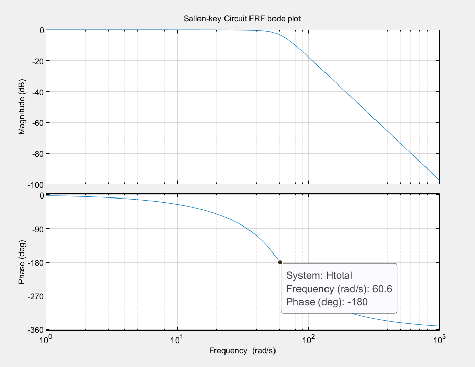
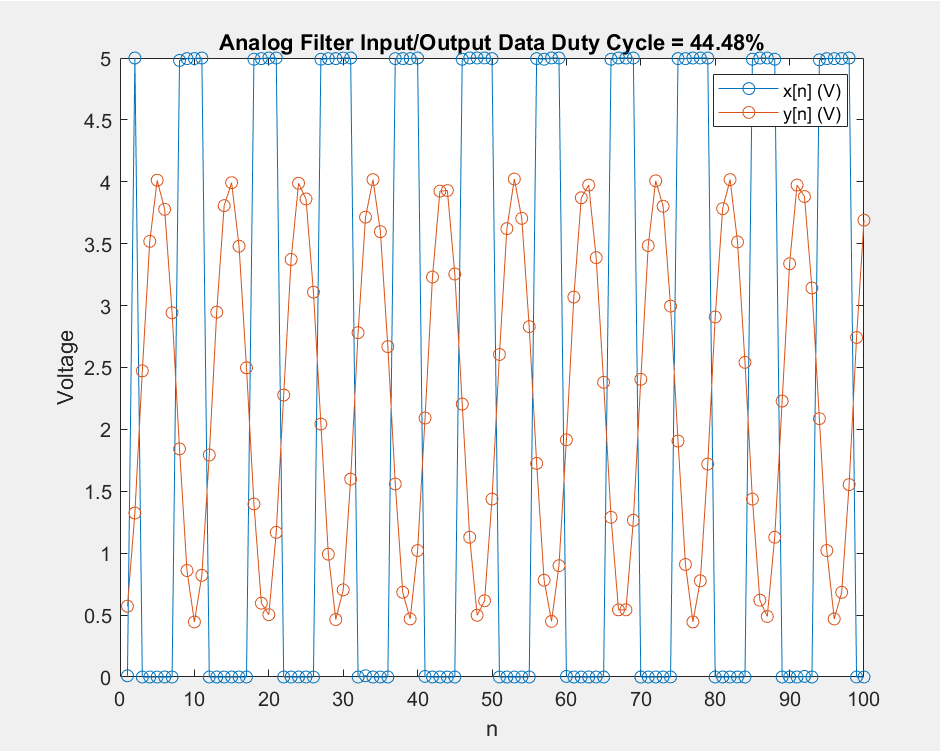
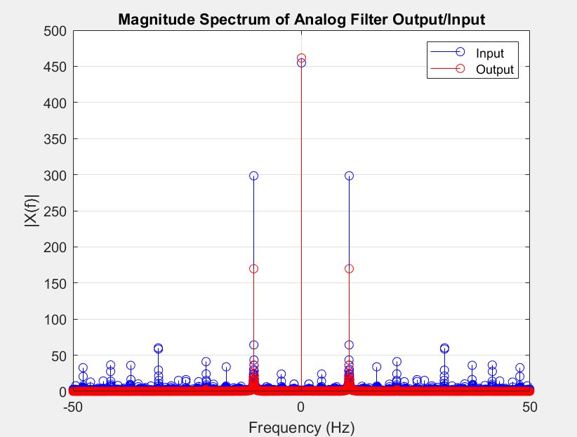
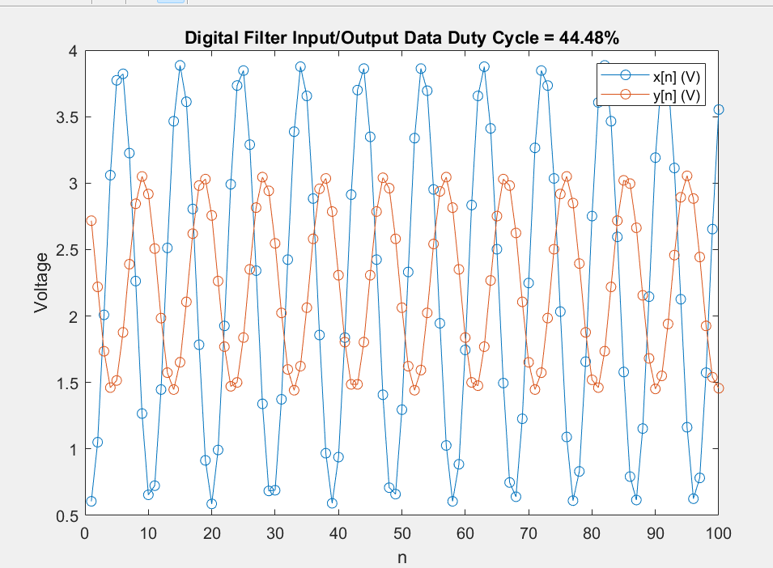
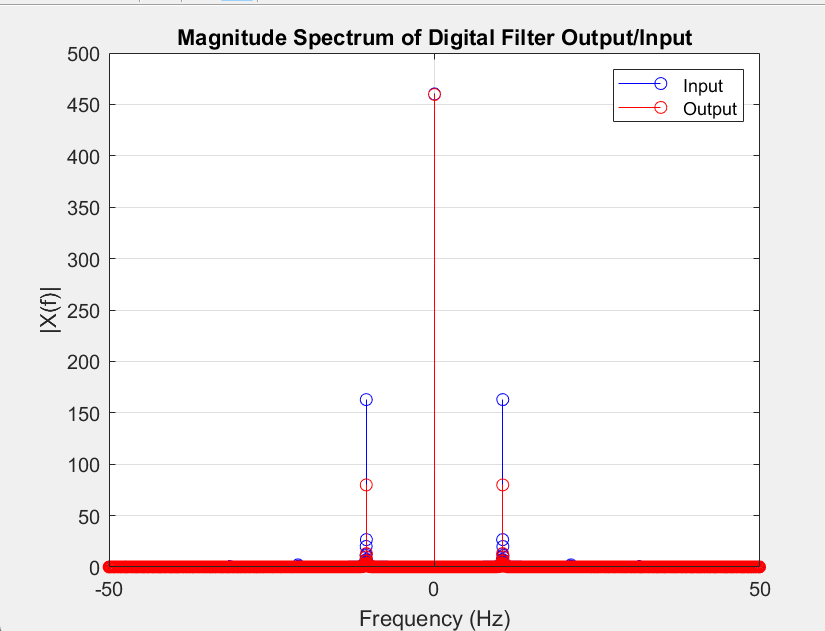

**Goal:** start from a 10 Hz square-ish pulse train from an oscillator chip and end with a 10 Hz sinusoid, using one analog stage and one digital stage, and show with Fourier analysis that each stage does what its math says.

## Characterizing the input

We sampled the oscillator at 100 Hz on an Arduino. From the mean and peak of the samples, its duty cycle was 44.48%. A 1000-point FFT with a Hann window to limit spectral leakage gave the first four harmonics, and they lined up with the analytical Fourier series coefficients for that duty cycle.

## Stage 1: analog Butterworth filter

Two cascaded Sallen-Key stages make a 4th-order Butterworth low-pass with poles evenly spaced on the left half-plane. We picked standard resistor values (47 kΩ, 270 kΩ, 27 kΩ and 100 kΩ) that put the cutoff at 10 Hz, and the Bode plot of the real component values gave a −3 dB point of 9.93 Hz.

The filter rounds the pulse train into a sine wave with a small phase shift. Measured harmonic by harmonic, it kept the 10 Hz fundamental and cut the 20, 30 and 40 Hz harmonics by more than 15×, in line with the predicted transfer function.

## Stage 2: modified comb filter on the Arduino

A comb filter puts zeros evenly around the unit circle. Removing the zeros at z = 1 and z = e±jπ/5 opens passbands at DC and at 10 Hz, and scaling the gain to 1 at DC gives the final filter. The Arduino runs its difference equation in real time at each sample.

After the comb filter, only the 10 Hz coefficient is left. The 2nd and 3rd harmonics drop to about 1% of their input level, and the 4th, already tiny after the analog stage, to about 11%.

## Sources of error

Small 20 and 30 Hz residuals got through the analog stage, which is expected for a 4th-order filter. In the digital stage, quantization and finite precision on the Arduino caused small amplitude and phase differences, and component tolerances and electrical noise accounted for the rest.
