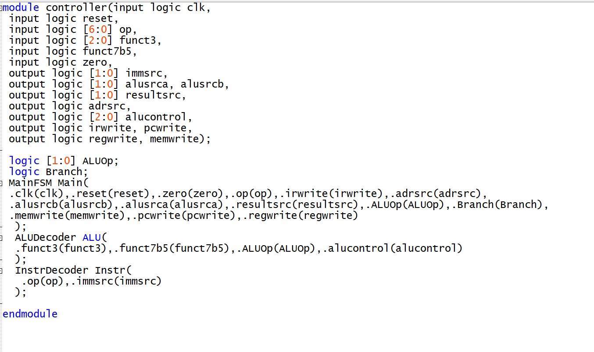
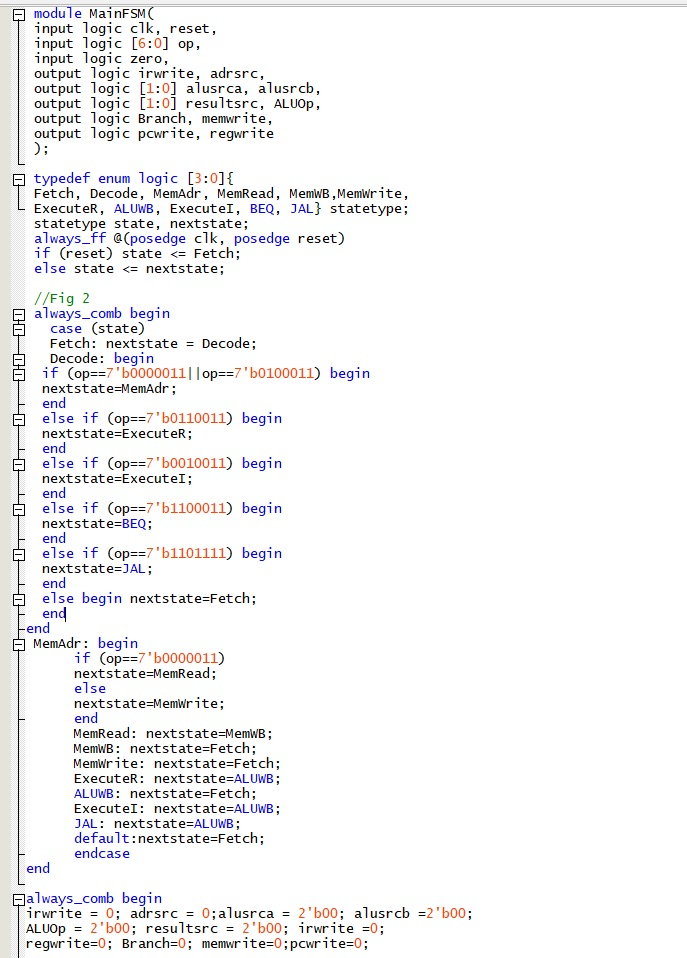
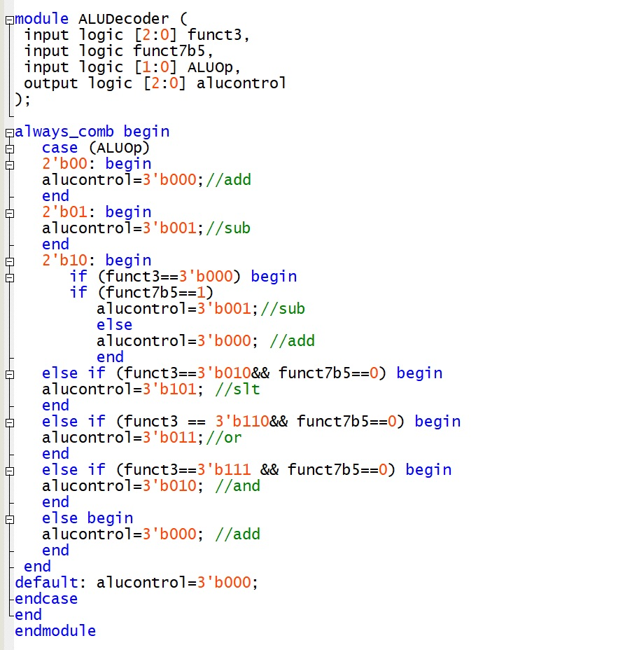
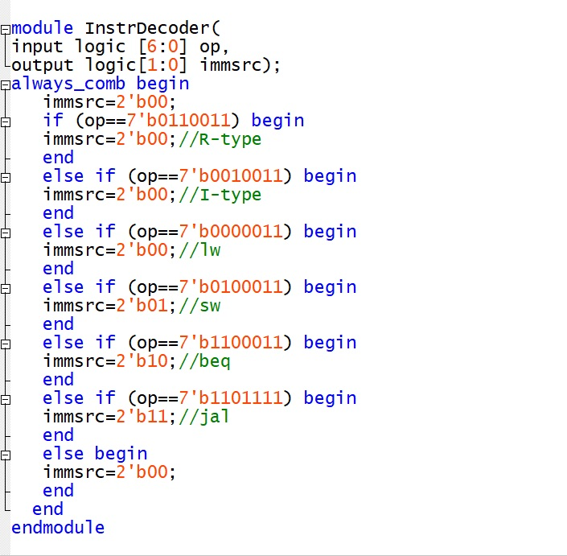

The controller reads the opcode and function fields of each instruction and drives every select and enable line in the datapath. It supports `lw`, `sw`, R-type arithmetic (`add`, `sub`, `and`, `or`, `slt`), I-type arithmetic, `beq` and `jal`.

## Structure

I followed the hierarchy of the reference design: a top-level controller wires together three submodules. Don't-care outputs are set to 0, so every signal has a known value during testing.

## Main state machine

The main FSM steps through fetch and decode, then branches to the right execute states for each instruction type: memory address, memory read and write-back for loads, memory write for stores, ALU write-back for arithmetic, and so on. Each state sets the multiplexer selects and write enables for that step.

## Decoders

The ALU decoder turns `ALUOp`, `funct3` and `funct7` bit 5 into the 3-bit ALU control, telling `add` from `sub` and picking `slt`, `or` and `and`. The instruction decoder picks the immediate format for each opcode.

## Testing

I ran the controller in Questa against the provided testbench and vectors. All 40 tests passed with 0 errors, so the controller was ready to drop into the full processor in Lab 11.
