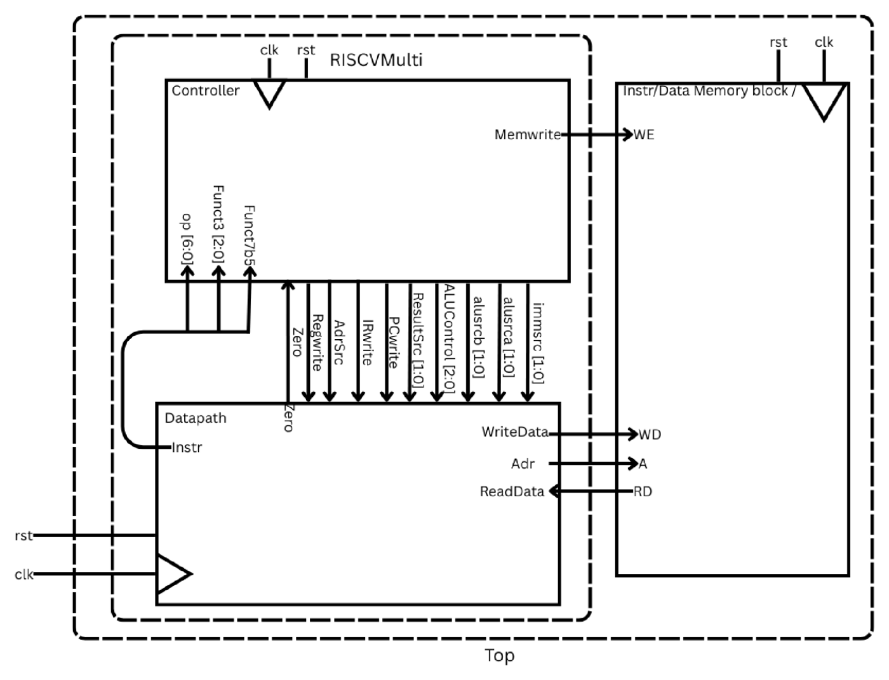
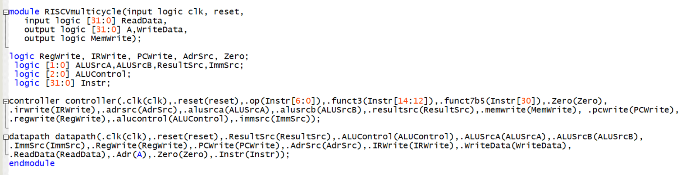
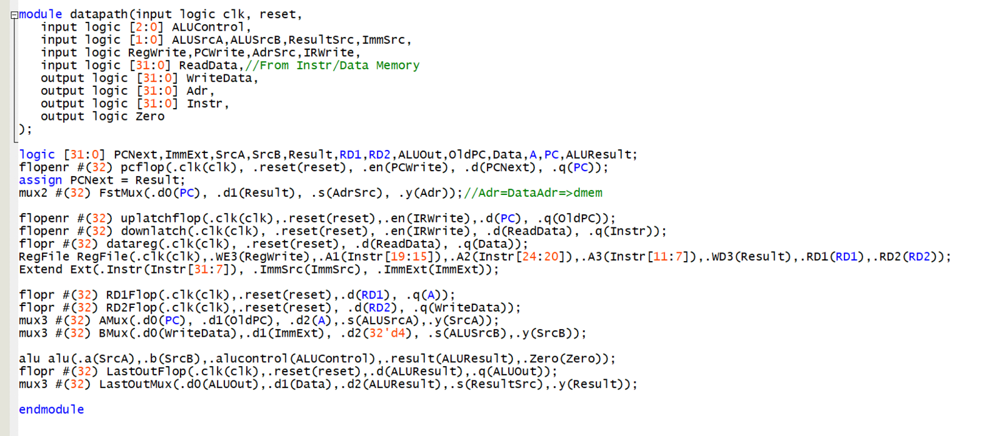
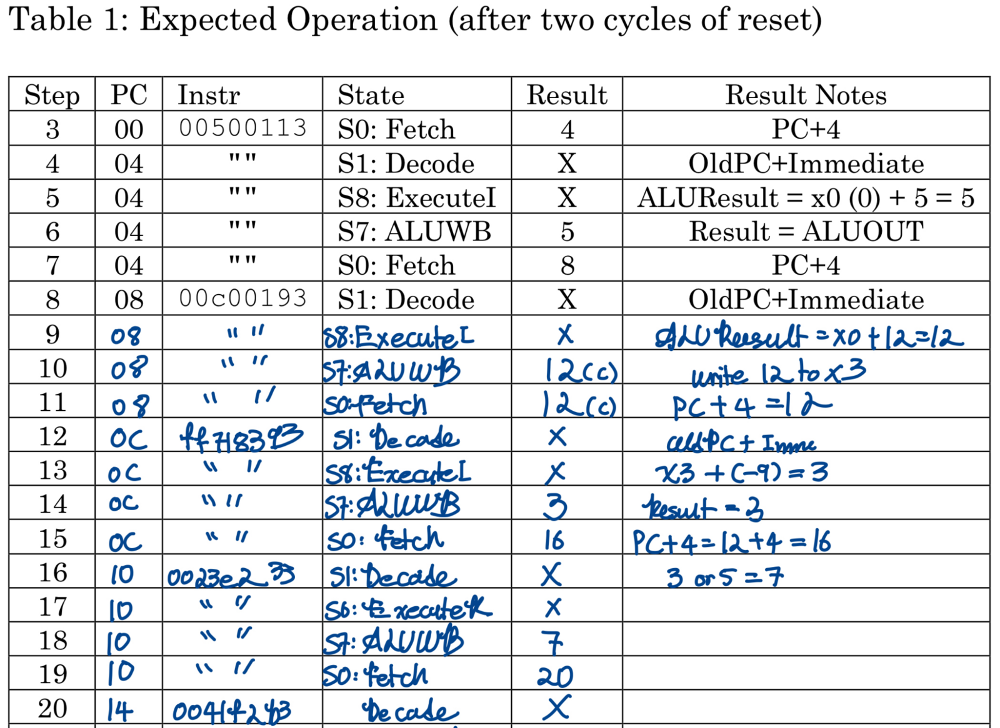
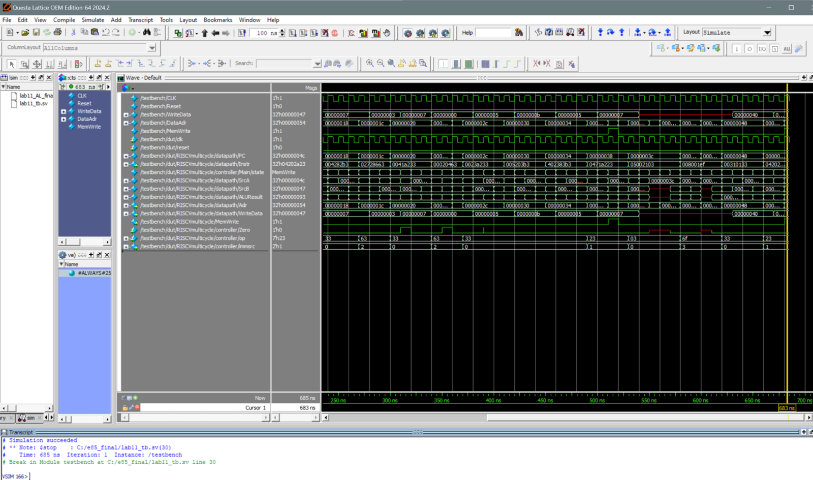

With the controller done, this lab adds the datapath and wraps both in a top-level module with one memory shared by instructions and data, the way a multicycle design expects.

## System design

The controller takes `op`, `funct3`, `funct7` bit 5 and `Zero` from the datapath and sends back every select and enable. The datapath holds the program counter, instruction and data registers, the register file, the ALU and the multiplexers between them.

Because the memory is shared, I moved the `$readmemh` that loads the program from the instruction memory into the combined memory module.

## Writing down what should happen

Before simulating, I traced the test program by hand: for every cycle, the PC, the instruction, the state the controller should be in, and the result it should produce. Having that table made it quick to spot the first cycle where the waveform disagreed with my expectations, which is where every bug hunt starts.

## Results

The full simulation runs the program to the end. The final check is the store: when `MemWrite` goes high, the processor writes `0x47` (71) to address `0x54`, exactly what the program expects.

