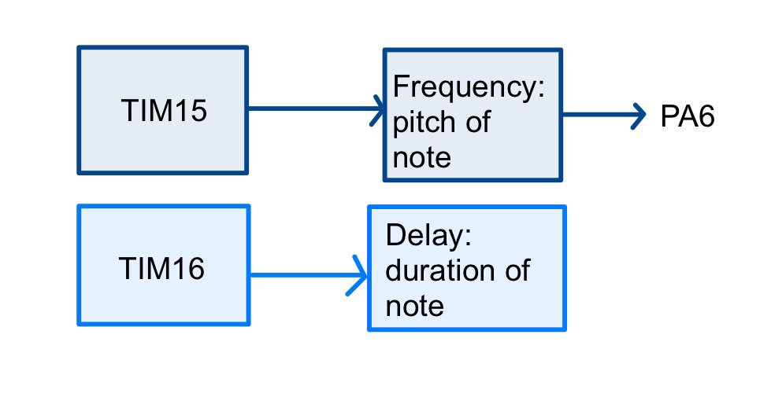

## Overview

The STM32L432KC plays a song from a table of note frequencies and durations. One timer generates the tone on a GPIO pin, and a second one times how long each note lasts. An LM386 amplifier (gain of 50) drives an 8 Ω speaker, with a 10 kΩ potentiometer for volume.

<iframe src="https://www.youtube.com/embed/J0WxFshaBSw" title="Digital audio demo" allowfullscreen></iframe>

## Timer design

With an 80 MHz system clock:

| | Tone timer (TIM16) | Delay timer (TIM1) |
|---|---|---|
| Prescaler | 199 | 7999 |
| Base frequency | 400 kHz | 10 kHz |
| Range | 6.1 Hz – 200 kHz | 0.1 ms – 6.55 s |

The auto-reload value for each note is ARR = 80 MHz / ((199 + 1) · f). Rather than checking every note by hand, I wrote a MATLAB script that computes the actual frequency for every pitch from A2 to A5 and every note length in the song.

