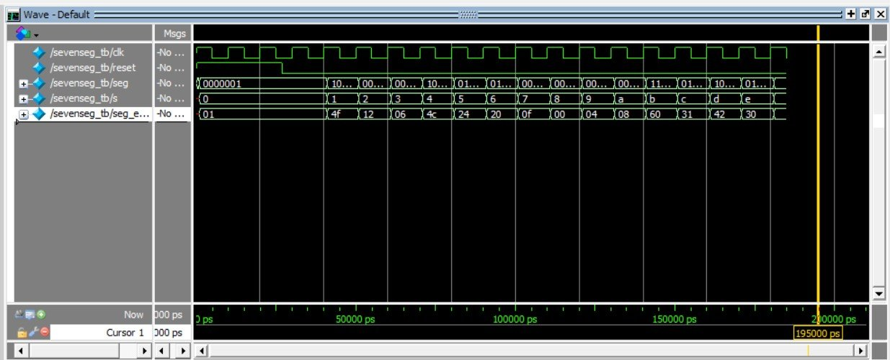
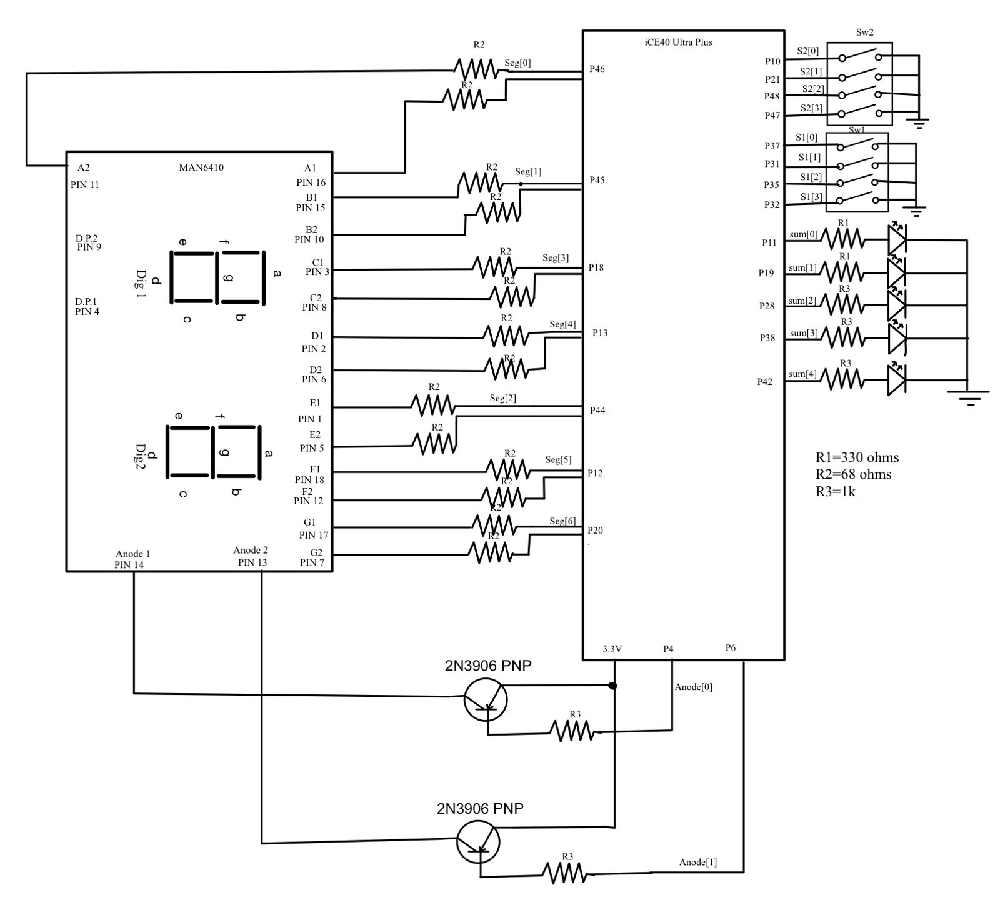
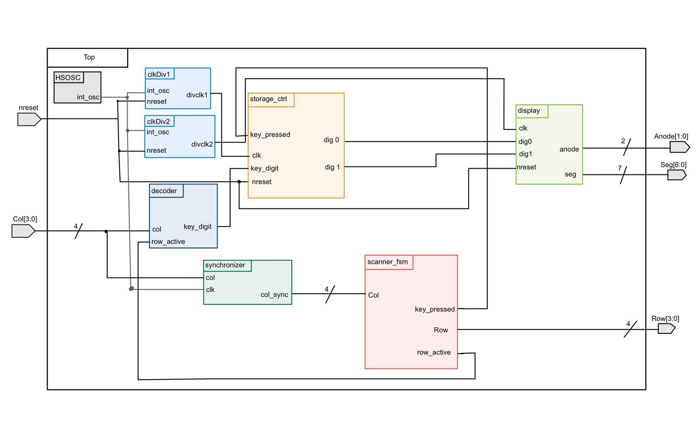

This project grew over three weeks, with each stage building on the last: a single seven-segment display, then two displays sharing one set of pins, then a keypad feeding them.

## Stage 1: seven-segment decoder

I started with a combinational decoder for hexadecimal digits 0–F, driven by four switches on an iCE40 UltraPlus FPGA. To keep each LED segment between 5 and 20 mA, I chose 68 Ω resistors: (3.3 V − 2.1 V) / 68 Ω ≈ 17 mA. I simulated every switch combination in QuestaSim and checked each one on hardware.

## Stage 2: time multiplexing

Next came two digits using the same number of I/O pins. The FPGA alternates which digit is powered fast enough that both appear lit. With a 24 MHz oscillator and a 12-bit counter, the switching rate is about 5.9 kHz, well past what the eye can see.

The I/O pins can only source 8 mA, so I used 2N3906 PNP transistors to drive each display's common anode. The datasheet gave a minimum base resistor of (3.3 − 0.7) V / 8 mA = 325 Ω, and I used 1 kΩ for margin.

## Stage 3: keypad scanning

The keypad needed to register each press exactly once: no repeats while a key is held, and no false presses from switch bounce.

- **Scanning.** The FSM drives one row low at a time (`0111`, `1011`, …) while the columns sit high on pull-up resistors, so a pressed key pulls its column low.
- **Debouncing.** A counter has to reach `DEBOUNCE_TIME` before a press is accepted. I picked this over an RC filter because the timing can be retuned for a different switch without changing any hardware.
- **Storage.** A separate module keeps the two most recent digits. Keeping it out of the scanner FSM made both modules simpler and easier to debug.
- **Synchronizer.** Column inputs pass through a synchronizer before reaching the FSM, which adds a two-cycle delay.

## Verification

The top-level testbench checks that a press that is too short is ignored, and that when two keys are pressed close together only the first one registers.

## What I'd do differently

Bring an oscilloscope in earlier to confirm each state fires at the right time on real hardware, instead of trusting the testbench alone. And keep the clock at the top level only, with clearer signal names from the start.
