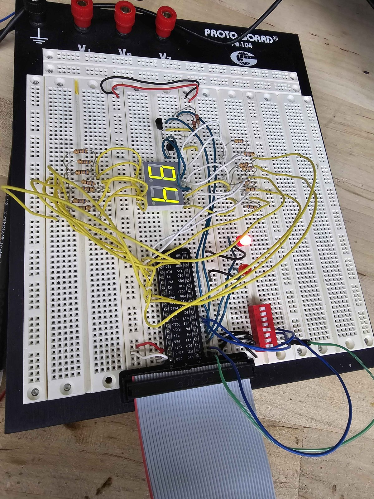
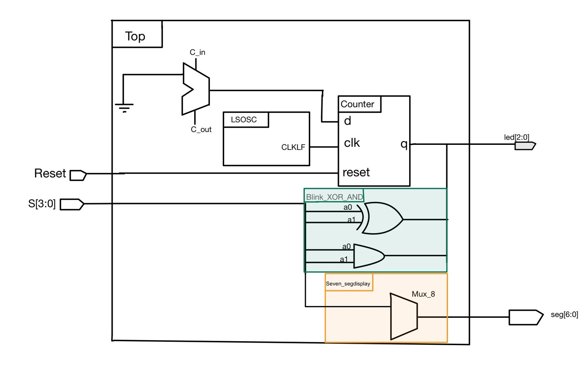
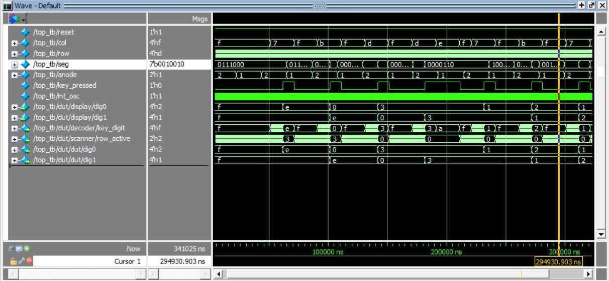
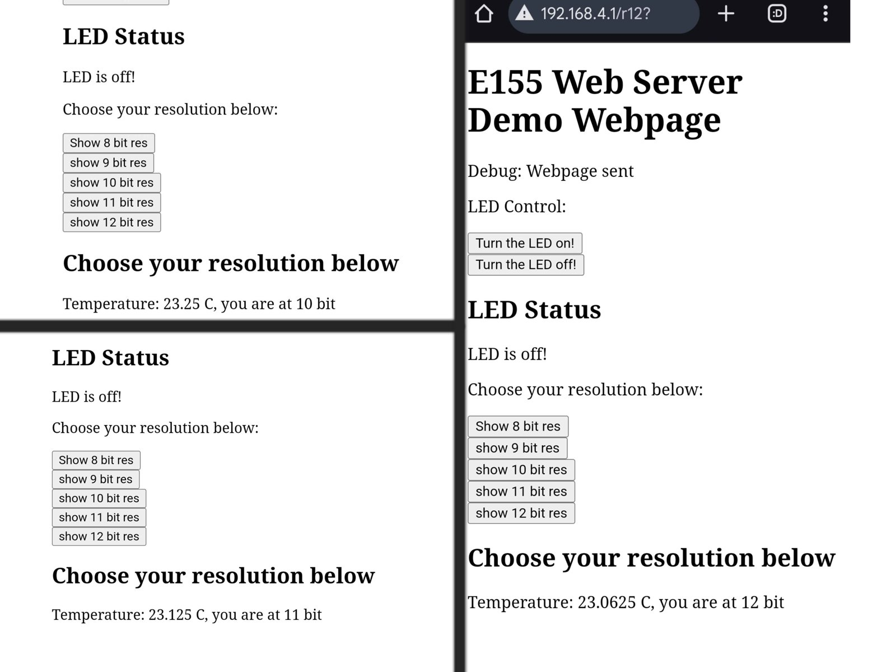
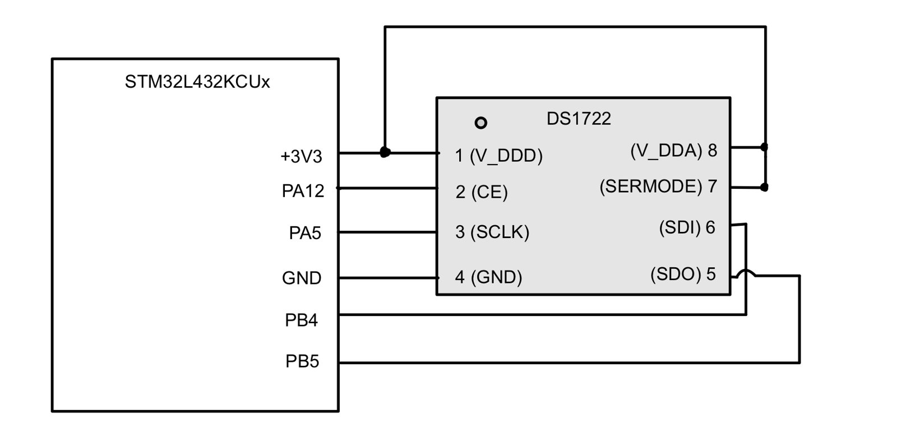
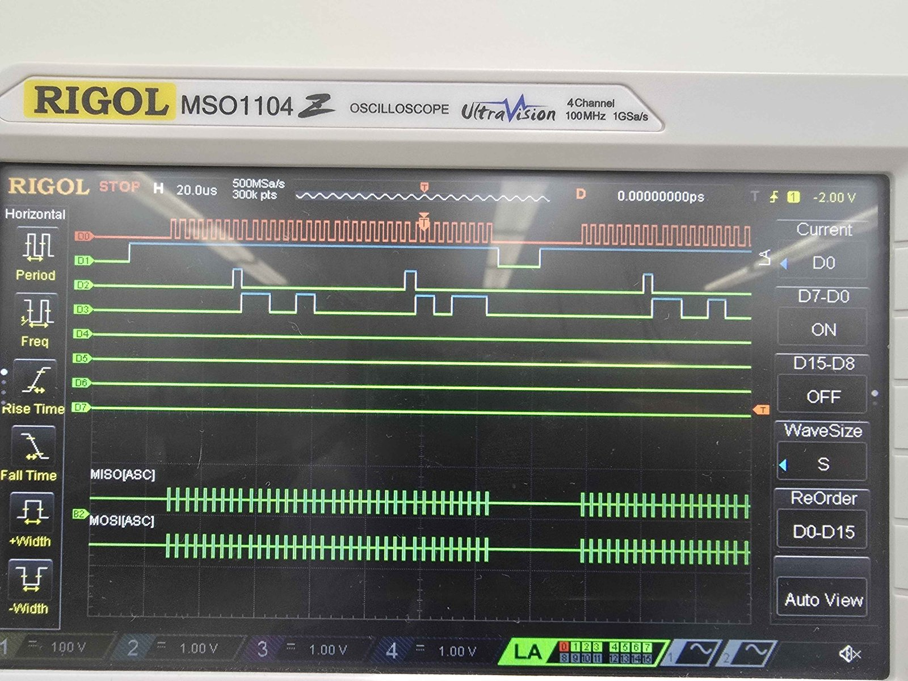
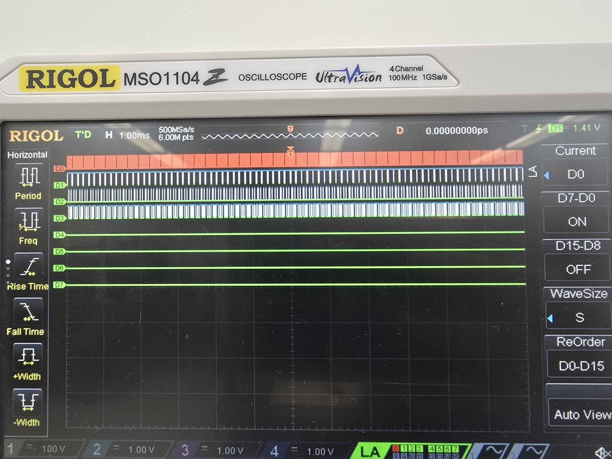
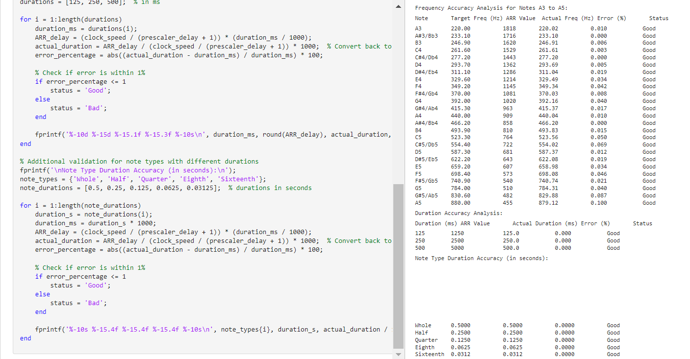
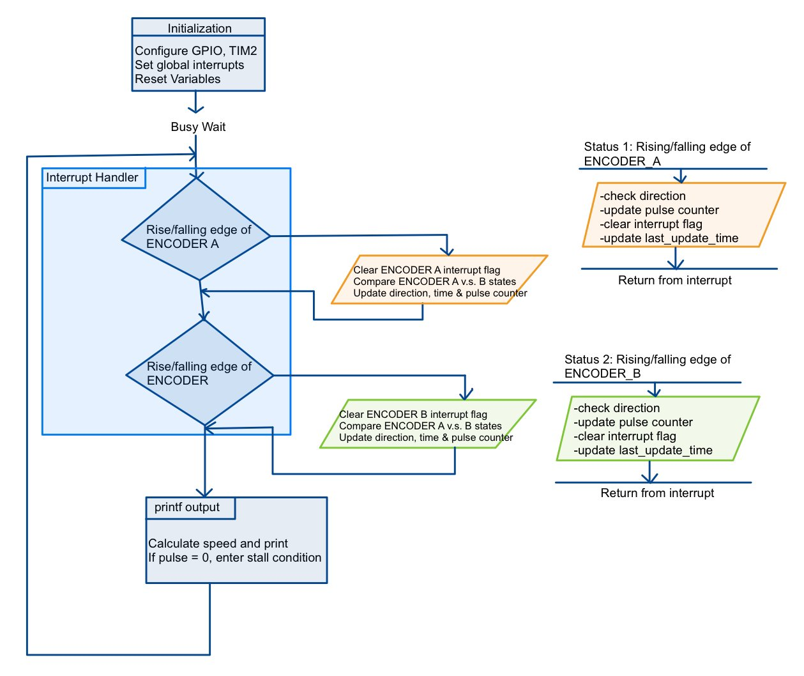

E155 at Harvey Mudd pairs an iCE40 UltraPlus FPGA with an STM32L432KC microcontroller. Over the semester I wrote SystemVerilog for the FPGA, bare-metal C for the microcontroller, and debugged both with testbenches, an oscilloscope and a logic analyzer. Each lab built on the one before, and the final project put both chips to work together.

- [Final project: interactive 2D physics engine](#final-project-interactive-2d-physics-engine)
- [Keypad scanner and multiplexed display](#keypad-scanner-and-multiplexed-display)
- [IoT temperature sensor and web server](#iot-temperature-sensor-and-web-server)
- [Digital audio player](#digital-audio-player)
- [Motor speed measurement with interrupts](#motor-speed-measurement-with-interrupts)

## Final project: interactive 2D physics engine

*With Stephen Xu.* A tilt-controlled sand simulator. The FPGA runs the particle physics and drives a 64×64 LED matrix in 12-bit color, while the STM32 reads an accelerometer and streams the gravity direction over SPI.

### What it does

Each lit pixel on a 64×64 LED matrix is a grain of sand. Tilt the box and gravity follows: the grains fall, pile up, collide with each other and with the walls, and settle in whatever direction is now "down."

<iframe src="https://www.youtube.com/embed/clDaFqf6akY" title="Interactive physics engine demo" allowfullscreen></iframe>

### System design

We split the work so each chip does what it is good at.

- **STM32L432KC microcontroller:** reads an MPU6050 accelerometer over 400 kHz I2C (±2 g range, 1 kHz sampling), turns the X and Y acceleration into a tilt angle with `atan2`, maps it to 0–360°, and sends it to the FPGA over a one-way SPI link.
- **FPGA:** acts as a physics accelerator. It treats each pixel as a cellular automaton, updates every particle based on the current gravity direction, and drives the LED matrix.

### Display driver

The matrix natively shows only 3-bit color (8 colors). We built a display driver that uses binary-coded modulation (BCM) to reach 12-bit color, which is 4,096 colors, while keeping the refresh rate above 300 Hz with no ghosting. BCM also gives a logarithmic, eye-friendly dimming curve. The driver is a three-state machine: shift a row of pixel data in, latch it, then enable the output.

### The hard part: memory

We originally planned to store the simulation in block RAM with double buffering. Timing problems with block RAM forced us to keep the particle state in LUTs instead, which limited how many particles we could simulate. We reworked the design around rotating frame buffers that hold the current and previous frame. It's a real lesson in checking a resource budget early.

### Testing

We checked both serial links with a logic analyzer and verified the physics engine in simulation before putting it on hardware.

### Results

We met every spec we set: sub-second response to tilt, 12-bit color, a refresh rate above 300 Hz, movement in eight directions, at least ten particles with particle and wall collisions, and a stable simulation with no drift over time. We hand-soldered the electronics on perfboard and designed a 3D-printed housing.

### What I'd do next

Get block RAM working so the engine can handle far more particles, and use more of the IMU's data so the sand reacts to shaking as well as tilt.

## Keypad scanner and multiplexed display

FPGA logic that scans a 4×4 keypad, debounces it with a state machine, and shows the last two keys on a time-multiplexed pair of seven-segment displays.

This project grew over three weeks, with each stage building on the last: a single seven-segment display, then two displays sharing one set of pins, then a keypad feeding them.

### Stage 1: seven-segment decoder

I started with a combinational decoder for hexadecimal digits 0–F, driven by four switches on an iCE40 UltraPlus FPGA. To keep each LED segment between 5 and 20 mA, I chose 68 Ω resistors: (3.3 V − 2.1 V) / 68 Ω ≈ 17 mA. I simulated every switch combination in QuestaSim and checked each one on hardware.

### Stage 2: time multiplexing

Next came two digits using the same number of I/O pins. The FPGA alternates which digit is powered fast enough that both appear lit. With a 24 MHz oscillator and a 12-bit counter, the switching rate is about 5.9 kHz, well past what the eye can see.

The I/O pins can only source 8 mA, so I used 2N3906 PNP transistors to drive each display's common anode. The datasheet gave a minimum base resistor of (3.3 − 0.7) V / 8 mA = 325 Ω, and I used 1 kΩ for margin.

### Stage 3: keypad scanning

The keypad needed to register each press exactly once: no repeats while a key is held, and no false presses from switch bounce.

- **Scanning.** The FSM drives one row low at a time (`0111`, `1011`, …) while the columns sit high on pull-up resistors, so a pressed key pulls its column low.
- **Debouncing.** A counter has to reach `DEBOUNCE_TIME` before a press is accepted. I picked this over an RC filter because the timing can be retuned for a different switch without changing any hardware.
- **Storage.** A separate module keeps the two most recent digits. Keeping it out of the scanner FSM made both modules simpler and easier to debug.
- **Synchronizer.** Column inputs pass through a synchronizer before reaching the FSM, which adds a two-cycle delay.

### Verification

The top-level testbench checks that a press that is too short is ignored, and that when two keys are pressed close together only the first one registers.

### What I'd do differently

Bring an oscilloscope in earlier to confirm each state fires at the right time on real hardware, instead of trusting the testbench alone. And keep the clock at the top level only, with clearer signal names from the start.

## IoT temperature sensor and web server

The STM32 reads a DS1722 temperature sensor through a register-level SPI driver I wrote, and serves live readings on a web page through an ESP8266.

The goal was an internet-connected temperature sensor. An STM32L432KC microcontroller talks to a DS1722 digital temperature sensor over SPI and to an ESP8266 Wi-Fi module over UART. Anyone on the network can open a web page to see the current temperature, change the sensor's resolution from 8 to 12 bits, and switch an LED on the board on or off.

### Firmware design

I used CMSIS for hardware abstraction and wrote the SPI driver myself at the register level. The code is split into three layers:

- **SPI and USART drivers.** SPI is configurable for baud rate, clock polarity and clock phase so it can work with other peripherals, and runs full-duplex with 8-bit frames. The transfer routine waits on the TXE flag before sending and the RXNE flag before reading, and accesses `SPI1->DR` through a `volatile` pointer so the compiler can't reorder or drop register accesses.
- **DS1722 driver.** It reads the two temperature bytes, combines them into a 16-bit signed fixed-point value (`hi << 8 | lo`), and divides by 256 to get degrees Celsius.
- **Web server.** It parses HTTP GET requests from the ESP8266 to set the LED and resolution, and builds the response page.

### Testing

I checked the sensor's range by warming it with a finger and cooling it with canned air to get readings below zero. Then I confirmed the SPI transactions on a logic analyzer: clock, chip select, CIPO and COPI from top to bottom.

### Lessons

Most of my debugging time went into SPI configuration, and into a broken breadboard wire that caused intermittent connections. That second problem is why I now check physical connections with a meter before assuming a bug is in the code.

## Digital audio player

Bare-metal STM32 firmware that plays music through a speaker, using two hardware timers for pitch and note length.

The STM32L432KC plays a song from a table of note frequencies and durations. One timer generates the tone on a GPIO pin, and a second one times how long each note lasts. An LM386 amplifier (gain of 50) drives an 8 Ω speaker, with a 10 kΩ potentiometer for volume.

<iframe src="https://www.youtube.com/embed/J0WxFshaBSw" title="Digital audio demo" allowfullscreen></iframe>

### Timer design

With an 80 MHz system clock:

| | Tone timer (TIM16) | Delay timer (TIM1) |
|---|---|---|
| Prescaler | 199 | 7999 |
| Base frequency | 400 kHz | 10 kHz |
| Range | 6.1 Hz – 200 kHz | 0.1 ms – 6.55 s |

The auto-reload value for each note is ARR = 80 MHz / ((199 + 1) · f). Rather than checking every note by hand, I wrote a MATLAB script that computes the actual frequency for every pitch from A2 to A5 and every note length in the song.

## Motor speed measurement with interrupts

Interrupt-driven quadrature decoding on the STM32 that measures motor speed and direction to within 0.05%.

A DC motor's quadrature encoder outputs two square waves, A and B, that are 90° out of phase. The firmware counts edges to find speed and compares A and B to find direction, then prints revolutions per second at least once a second.

### Design

- The encoder runs at 5 V, so I put its outputs on the STM32's 5 V-tolerant pins.
- Both channels fire external interrupts on rising and falling edges, which gives 4× resolution: 360 pulses per revolution × 4 = 1,440 counts per revolution. Encoder interrupts have priority over other tasks.
- TIM2 timestamps the measurement interval, and the main loop converts counts to rev/s. Positive values mean clockwise rotation.

### Interrupts vs. polling

At 12 V the motor should spin at about 10 rev/s, and I checked readings against that reference in both directions. I also built a polling version to compare:

| | Interrupts | Polling |
|---|---|---|
| Measured speed at 12 V | 9.918 rev/s | 15.9 rev/s |
| Error | < 0.05% | ~50% |
| Response time | < 1 µs | ~1 ms |
| CPU load | Low | High |

Polling misses edges at speed, which is why its reading is so far off. Interrupts take more care to get right, but they're the only approach that holds up here.
