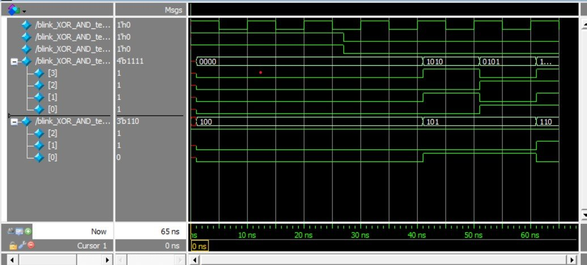
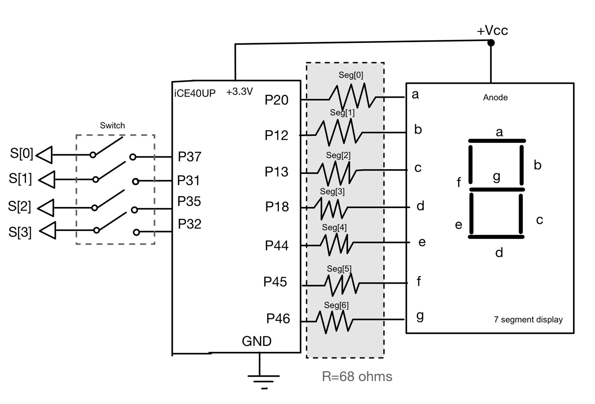

The first lab was about getting comfortable with the hardware: soldering surface-mount parts onto the development board, writing basic combinational SystemVerilog in Lattice Radiant, and simulating it before trusting it on hardware.

## Board test

To check the board, I lit two LEDs with the XOR and AND of two switches and blinked a third at 2.4 Hz. The blink comes from the 10 kHz low-speed oscillator and a 12-bit counter: 10 kHz / 2¹² ≈ 2.44 Hz. A reset makes the simulation start from a known value instead of a random one.

## Seven-segment decoder

A combinational case statement maps each of the 16 switch combinations to the segments for hex digits 0–F, with `seg[0]` as segment a, `seg[1]` as segment b, and so on.

Each LED segment needs 5–20 mA. With a 3.3 V supply and a 2.1 V forward drop, a 68 Ω resistor gives (3.3 − 2.1) V / 68 Ω ≈ 17 mA.

## Testing

I ran all 16 switch combinations in QuestaSim and then on the breadboard, so no edge case was left untested.

