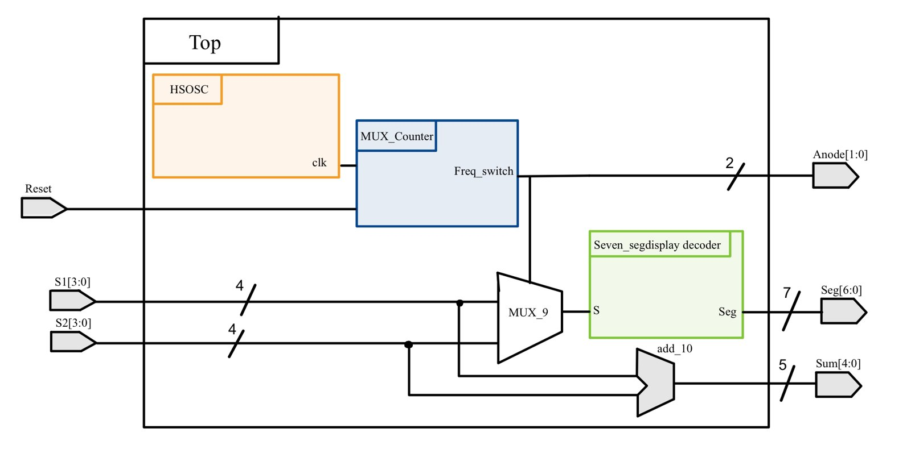
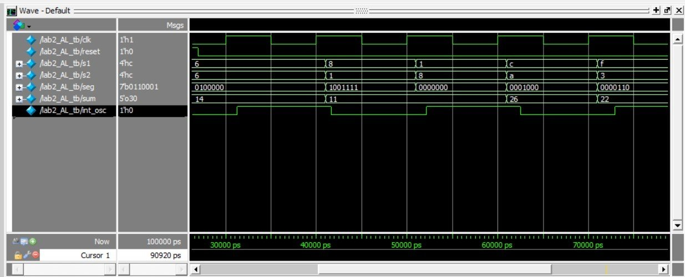

This lab extends Lab 1 to two digits that show two hex inputs and their sum, without using any more I/O pins. The FPGA powers one digit at a time and switches between them faster than the eye can see.

## Driving the displays

The iCE40UP datasheet limits each I/O pin to 8 mA, which isn't enough to light a whole digit. I used 2N3906 PNP transistors to switch each display's common anode, with the emitter on 3.3 V and the base on a GPIO pin. The minimum base resistor is (3.3 − 0.7) V / 8 mA = 325 Ω, and I used 1 kΩ for margin. The segments keep the 68 Ω resistors from Lab 1.

## Logic

I reused the Lab 1 decoder as its own module. A 12-bit counter on the 24 MHz high-speed oscillator toggles which digit is on at 24 MHz / 2¹² ≈ 5.9 kHz, and a mux picks which input goes to the decoder.

## Testing

The testbench covers representative cases, including two equal inputs and two different ones. Each vector holds input 1, input 2, the anode select, the segments and the sum.

## Looking back

It worked, but the code was messier than it needed to be: a few unused signals and names that didn't say what they did. Since then I split muxes into their own modules, keep the clock at the top level only, and name signals for their job.
