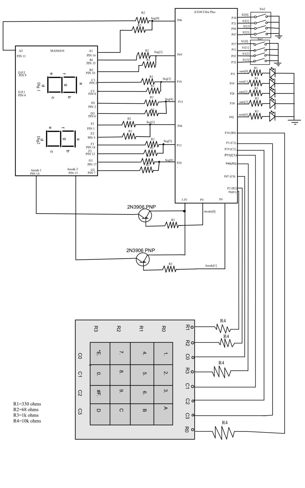
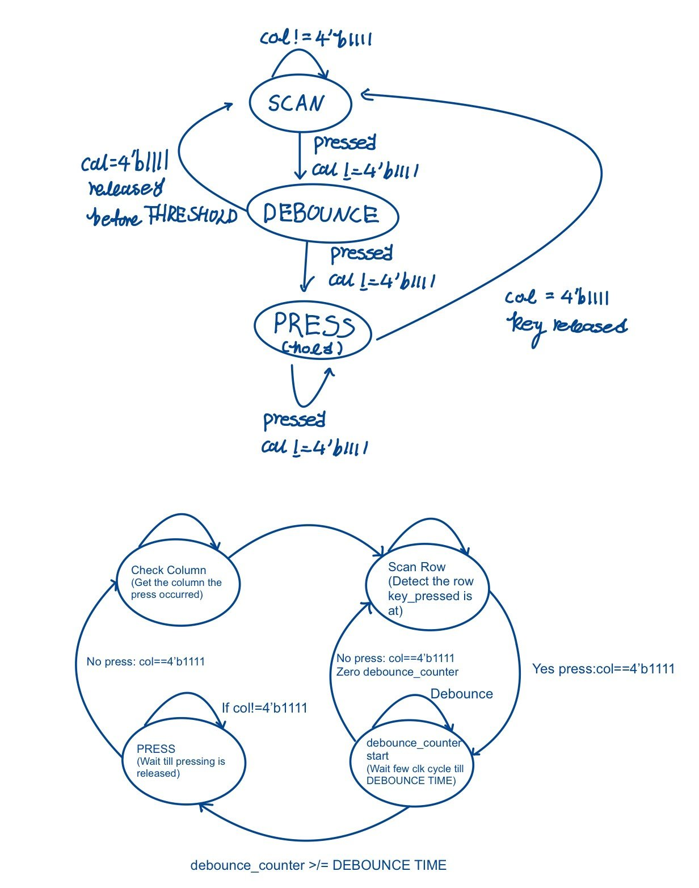
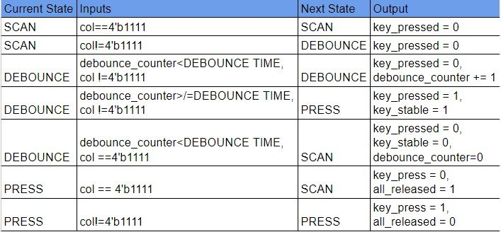
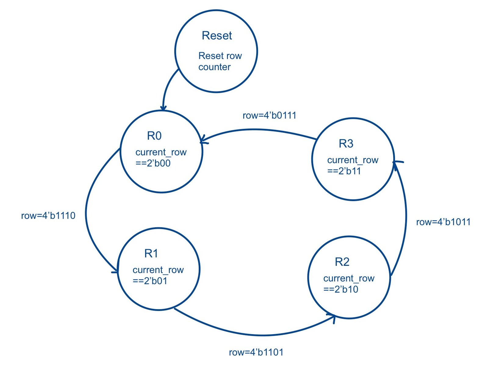
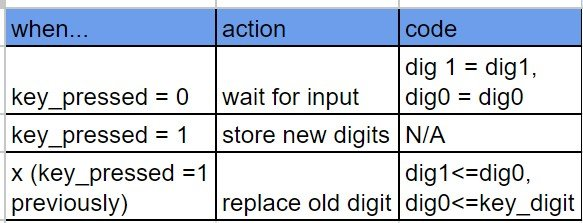
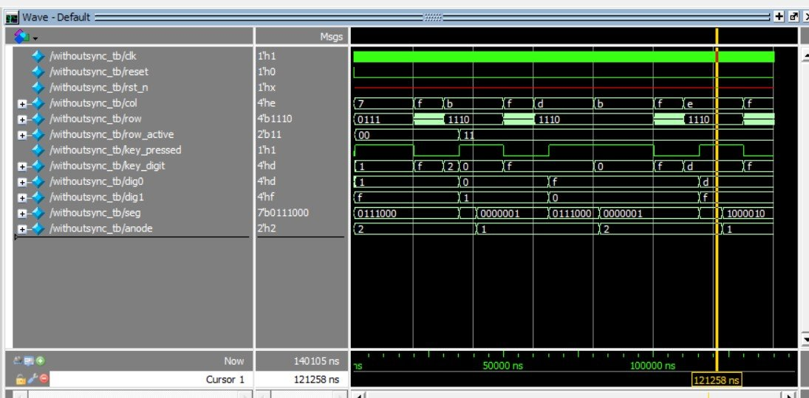

The keypad had to register each press exactly once: no repeats while a key is held, and no false presses from switch bounce. The last two keys appear on the dual display, newest on the right.

## Hardware

The columns sit high on pull-up resistors. The scanner drives one row low at a time (`0111`, `1011`, …), so a pressed key pulls its column low.

## Modules

- **Scanner FSM** watches the columns, decides whether a press happened, and drives the rows.
- **Decoder** turns the active row and column into a hex digit.
- **Storage** keeps the two most recent digits in a pair of registers. Keeping it out of the scanner made both modules simpler to debug.
- **Display** is the multiplexed driver from Lab 2.

Column inputs pass through a two-flop synchronizer before reaching the FSM.

## Debouncing

A counter has to reach `DEBOUNCE_TIME` before the FSM moves to the pressed state; if the key is released first, it goes back to scanning. I chose this over an RC filter because the timing can be retuned for a different switch in code, at the cost of a small delay before the digit appears.

## Registering one press per key

The display updates on the rising edge of `key_pressed`, so holding a key down never adds another digit.

## Verification

The top-level testbench checks that a press that is too short is ignored, and that when two keys are pressed close together only the first one registers.

## What I'd do differently

Bring an oscilloscope in earlier to confirm each state fires at the right time on real hardware, instead of trusting the testbench alone.
