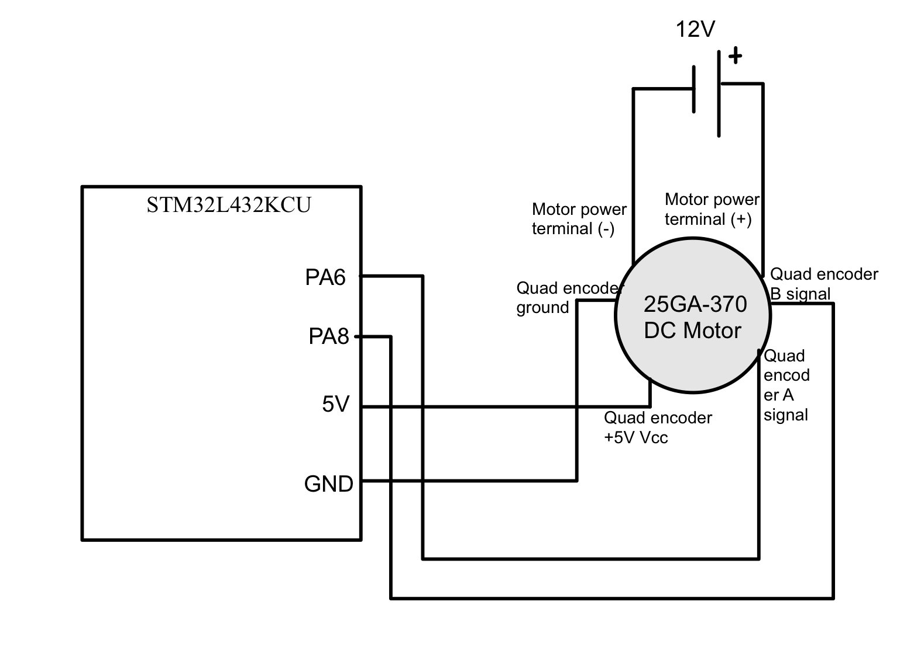

## Overview

A DC motor's quadrature encoder outputs two square waves, A and B, that are 90° out of phase. The firmware counts edges to find speed and compares A and B to find direction, then prints revolutions per second at least once a second.

## Design

- The encoder runs at 5 V, so I put its outputs on the STM32's 5 V-tolerant pins.
- Both channels fire external interrupts on rising and falling edges, which gives 4× resolution: 360 pulses per revolution × 4 = 1,440 counts per revolution. Encoder interrupts have priority over other tasks.
- TIM2 timestamps the measurement interval, and the main loop converts counts to rev/s. Positive values mean clockwise rotation.

## Interrupts vs. polling

At 12 V the motor should spin at about 10 rev/s, and I checked readings against that reference in both directions. I also built a polling version to compare:

| | Interrupts | Polling |
|---|---|---|
| Measured speed at 12 V | 9.918 rev/s | 15.9 rev/s |
| Error | < 0.05% | ~50% |
| Response time | < 1 µs | ~1 ms |
| CPU load | Low | High |

Polling misses edges at speed, which is why its reading is so far off. Interrupts take more care to get right, but they're the only approach that holds up here.
