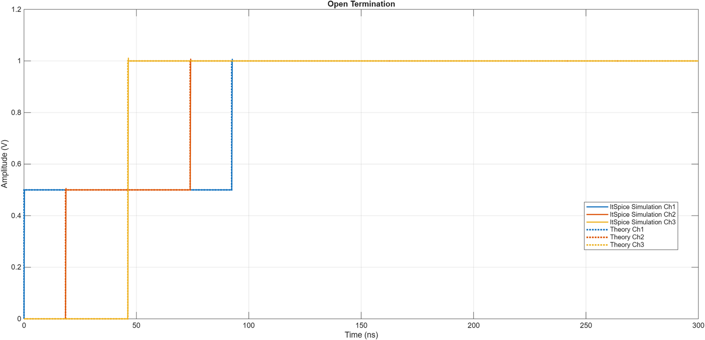
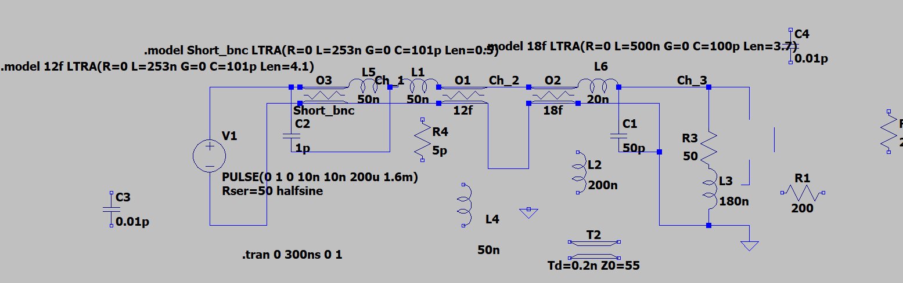
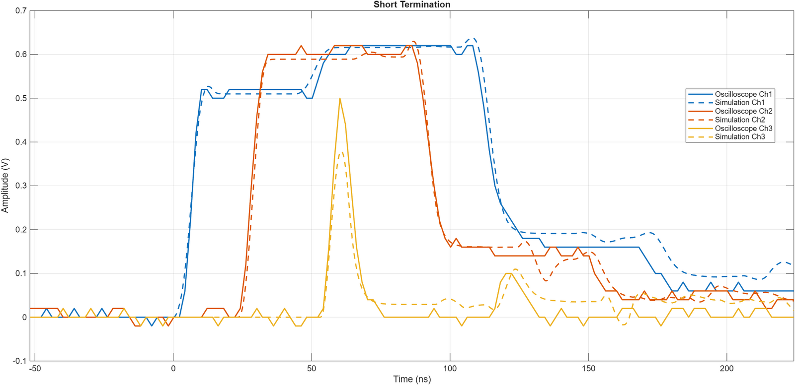

**Goal:** predict the step response at three points along a chain of 50 Ω BNC cables for open, short, matched, 22 Ω and 200 Ω terminations, then build each case and match it in simulation.

I wrote a Python model that tracks each incident and reflected wave, using Γ = (ZL − Z0) / (ZL + Z0) and a delay of 1.54 ns per foot for 0.66c cable. For a shunt resistor partway down the line with a mismatched load, the wave bounces between the two discontinuities, so the model loops until the voltage settles at the DC voltage-divider value.

The real measurements had slower edges, overshoot and some loss. To explain them I added parasitics to the LTspice model one at a time: series inductance at the connectors, shunt capacitance at the probes, and short sections of line for the BNC tees. With those in place the simulation follows the oscilloscope closely.

I also used the measurements to work backwards. With a 200 Ω termination, the reflected step implied an effective load of about 128 Ω at the edge, which pointed to parasitic capacitance at the resistor and connector.

## Standing waves

For a 22 Ω load I predicted a VSWR of 2.27 and swept a sine wave from 3.4 to 6.8 MHz, the range that spans one maximum and one minimum at the probe point. Fitting a lossy line model to the measured sweep lined the simulation up with the oscilloscope.

