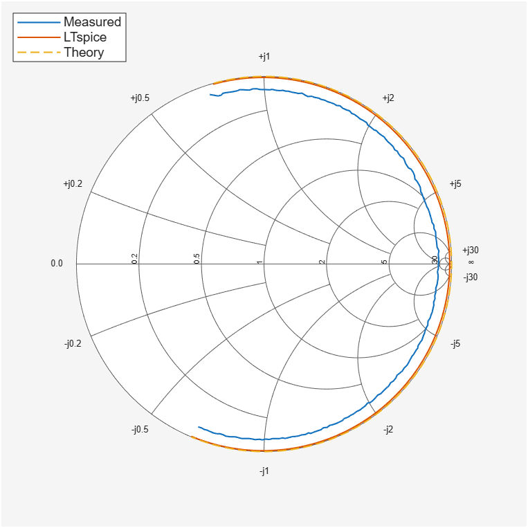
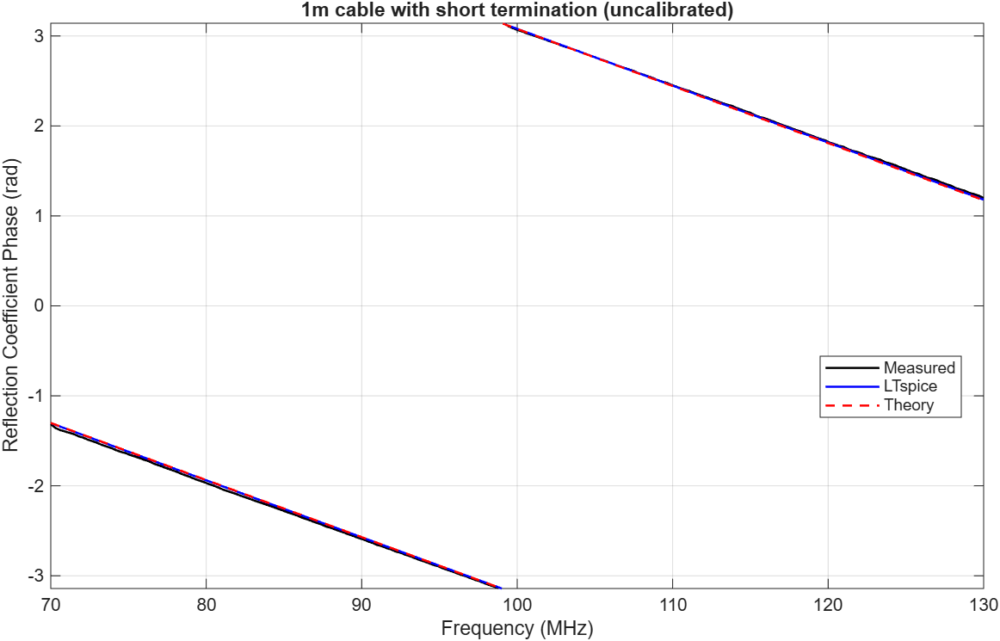
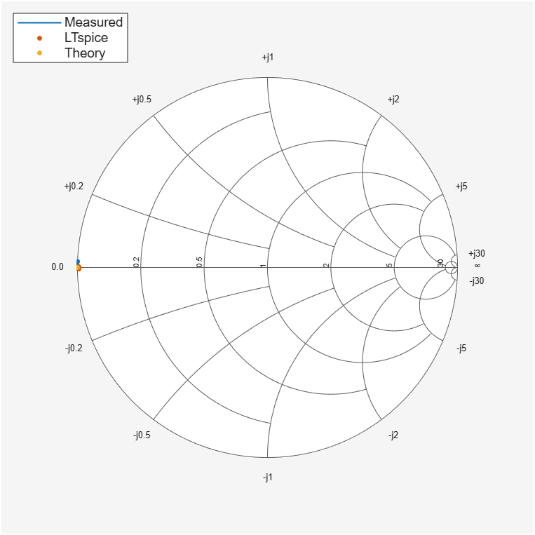
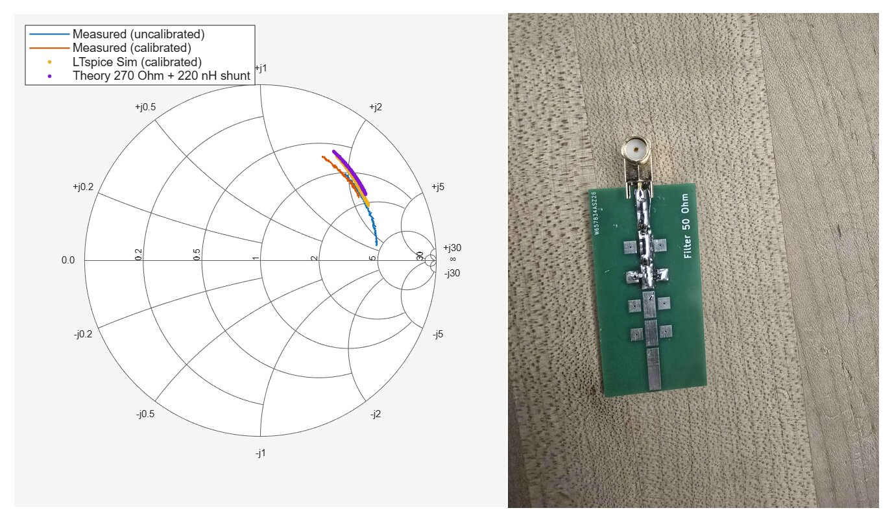
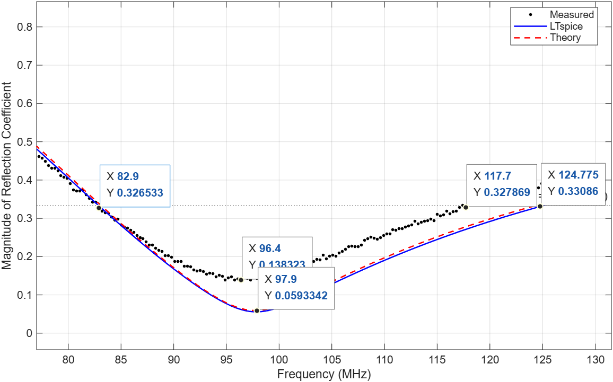

**Goal:** match a 270 Ω load to a 50 Ω line at 100 MHz with an L-network, built component by component on a surface-mount test board.

## Calibrating the VNA

Before calibration the VNA measures everything between its internal port and the load, including a meter of coax. That cable adds phase that grows with frequency, so a plain short circuit sweeps around the edge of the Smith chart instead of sitting at one point. Cable loss also pulls the magnitude below 1, and more so at higher frequency because of skin effect and dielectric loss. My measurement, LTspice simulation and hand analysis all agreed once I used the lab cable's velocity factor of 0.66.

An open/short/load calibration solves for the error terms at every frequency point. After it, the short collapses to Γ = −1, the open to +1 and the 50 Ω load to the center. Changing the span to 90–110 MHz without recalibrating smeared the points out again slightly, a good reminder that a calibration only holds for the frequencies it was taken at.

## Building the match one part at a time

My 270 Ω load was a 330 Ω and a 1.5 kΩ resistor in parallel. Its measured reflection at 100 MHz pointed to about 257 Ω instead, so I redesigned around the measured value rather than the nominal one.

I soldered the shunt inductor first and measured again. The closest part to my calculated 204 nH was 220 nH, which put the load at 57.7 + j107 Ω. From that measured point I recalculated the series capacitor, C = 1 / (2π · 107 Ω · 100 MHz) ≈ 14.9 pF, and used 15 pF. Checking the Smith chart after every part is how you get a good match from hand-assembled boards.

## Results

The best match landed at 96.4 MHz. Using a |Γ| = 1/3 bandwidth from 82.9 to 117.7 MHz, the measured Q was **2.77**, against **2.34** from my model. I traced the 15% difference to part tolerances, the inductance of the 0 Ω jumpers, and some unmodeled parasitic capacitance: the low band edge matched exactly, but the high edge came in early, which is what extra capacitance would do.

