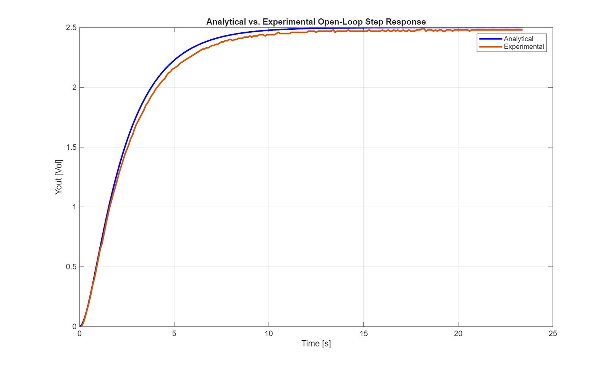
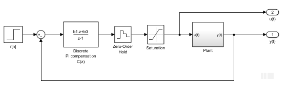
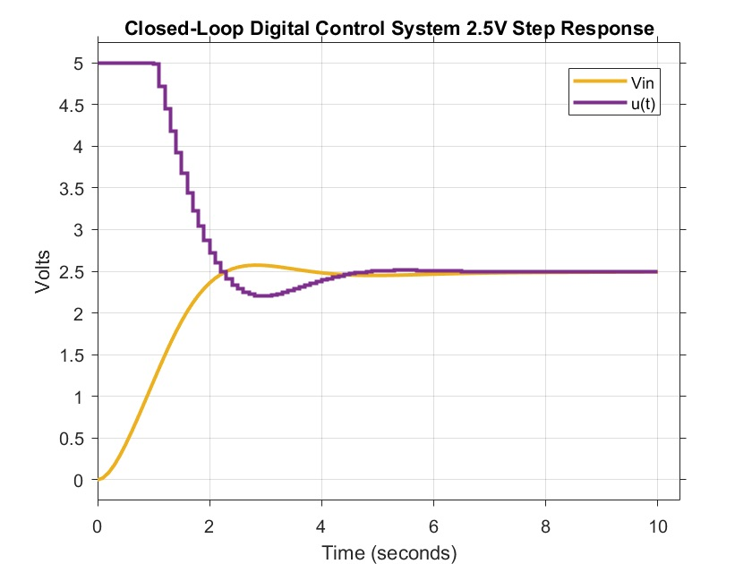
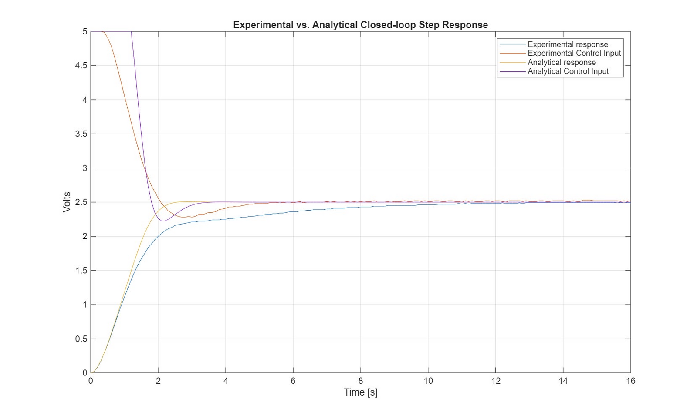
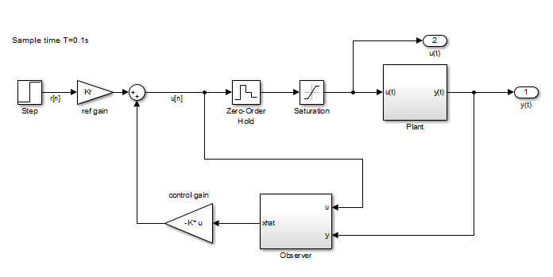
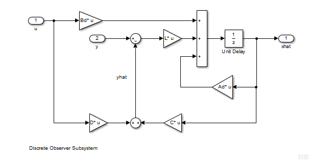
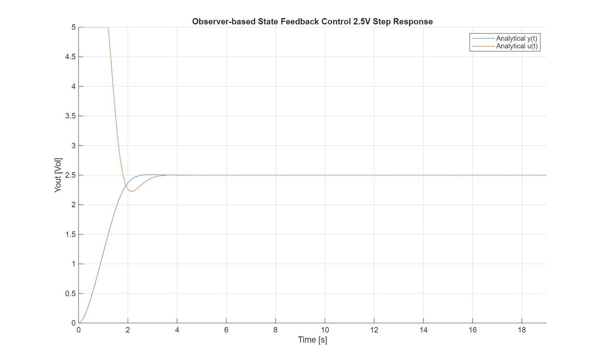

**Goal:** drive an overdamped second-order RC circuit to a 2.5 V step with less than 1% overshoot, zero steady-state error, a 1% settling time under 4 s and as little control effort as possible, sampling at 10 Hz with the input limited to 0–5 V.

## Modeling the plant

The circuit is two RC stages (R = 50 kΩ, C = 10 µF) around an LMC6484 op amp. We derived its transfer function, H(s) = 1 / ((0.5s + 1)(2s + 1)), the state-space model, and the analytical step response. Then we built the circuit and drove it from an Arduino Uno, reading the output on the ADC and setting the input with PWM. The measured open-loop response lined up with the analytical one.

## Controller 1: digital PI

We designed a PI compensator for a 70° phase margin at a 1 rad/s crossover by solving the phase and magnitude conditions in MATLAB, which gave Kp = 2.35 and Ki = 0.86. Discretized with backward differencing, it becomes a two-term difference equation the Arduino runs each sample: u[n] = u[n−1] + b₀e[n] + b₁e[n−1].

We swept phase margin and crossover frequency on the real circuit. Some trends matched theory: raising the crossover frequency shortened settling, and a 90° phase margin at 1 rad/s drives Ki to zero, which explained the steady-state error we saw there. Overshoot stayed at zero for nearly every setting, but the best settling time we measured was about 5.9 s (52°, 6 rad/s). The output reached 2.3–2.4 V quickly and then crept the rest of the way to 2.5 V.

## Controller 2: observer-based state feedback

We discretized the plant with a zero-order hold at T = 0.1 s and designed full state feedback with discrete LQR (`dlqr`), weighting output error over the second state with Q = diag(100, 1) and R = 1. A reference gain Kr gives zero steady-state error, and since only the output is measured, an observer estimates both states, with its poles placed at twice the speed of the closed-loop poles.

On the circuit this controller met every spec. My MATLAB script sweeps Q and recomputes K and Kr so we could compare trials quickly:

| Q₁₁ | Q₂₂ | 1% settling | Overshoot | Steady-state error |
|---|---|---|---|---|
| 100 | 1 | 3.07 s | 0.36% | 0.003 V |
| 100 | 10 | 3.98 s | 0.2% | 0.005 V |
| 200 | 1 | 2.82 s | 0.36% | 0.005 V |
| 50 | 10 | 5.18 s | 0% | 0.006 V |

Raising Q₁₁ pushes the poles left and shortens settling at the cost of a little more control effort. Raising Q₂₂ trades speed for less actuation and less peaking.

## Why simulation and hardware differ

The circuit was consistently slower and more damped than the model. The main reasons:

- **Part values.** We used a 47 kΩ resistor in place of 50 kΩ, on top of 5% tolerances, plus pF-level parasitic capacitance.
- **Measurement noise.** The Uno's ADC read about ±0.02 V of noise at steady state, which the controller multiplies when it computes the next input.
- **Idealizations.** The model assumes an ideal op amp and a smooth input voltage, while the Uno actually outputs 980 Hz PWM.

Integral action in the PI loop, and a little retuning on the hardware, made the controllers robust to those differences.
